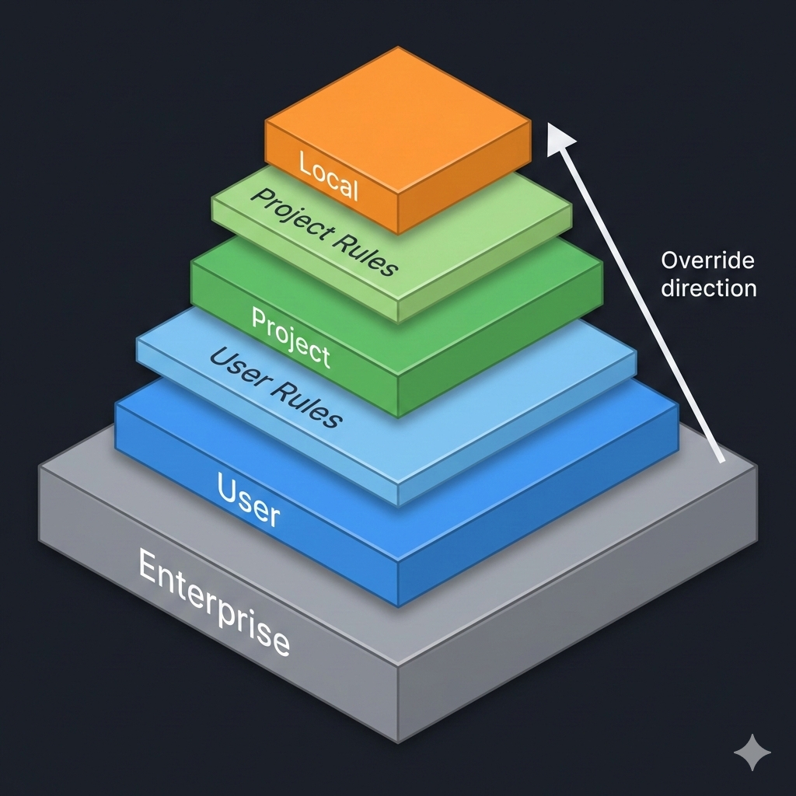
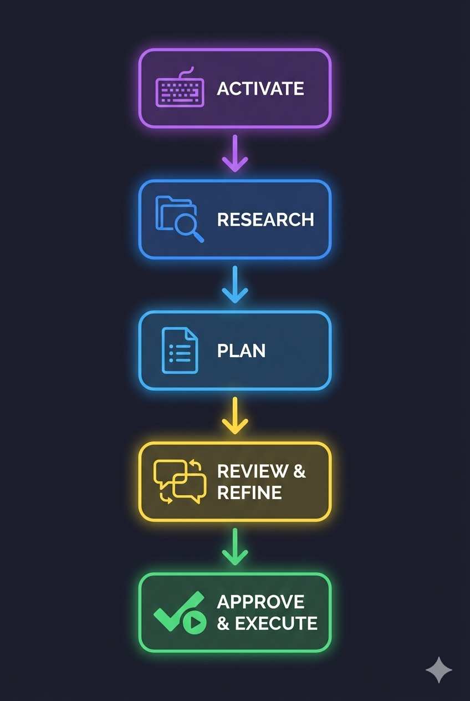

# Claude Code Fundamentals

<div align="center">


[](https://code.claude.com)
[](LICENSE)
[]()

**A comprehensive guide to Claude Code—Anthropic's agentic coding tool.**

[Getting Started](#what-is-claude-code) • [Memory](#claudemd-memory--configuration) • [Context](#context-management) • [Plan Mode](#plan-mode) • [Skills](#skills) • [Sub-Agents](#sub-agents) • [Hooks](#hooks)

</div>

---

## Table of Contents

1. [What is Claude Code?](#what-is-claude-code)
   - [Why Claude Code?](#why-claude-code)
   - [Using a Different Tool?](#using-a-different-tool)
   - [Installation](#installation)
   - [Human-in-the-Loop: Permission Tiers](#human-in-the-loop-permission-tiers)
   - [Essential Commands](#essential-commands)
2. [CLAUDE.md: Memory & Configuration](#claudemd-memory--configuration)
   - [The Memory Hierarchy](#the-memory-hierarchy)
   - [Global vs Project CLAUDE.md](#global-vs-project-claudemd)
   - [The Rules Directory](#the-rules-directory)
   - [Importing External Files](#importing-external-files)
   - [The Learning Loop](#the-learning-loop)
   - [Scaffolding: Your Project Factory](#scaffolding-your-project-factory)
   - [Protecting Sensitive Files](#protecting-sensitive-files)
3. [Context Management](#context-management)
   - [When to Reset](#when-to-reset)
   - [Context Commands](#context-commands)
   - [Persisting Context Across Sessions](#persisting-context-across-sessions)
4. [Plan Mode](#plan-mode)
   - [When to Use Plan Mode](#when-to-use-plan-mode)
   - [How It Works](#how-it-works)
   - [The Plan Mode Workflow](#the-plan-mode-workflow)
5. [Extending Claude Code](#extending-claude-code)
   - [The Three Mechanisms](#the-three-mechanisms)
   - [Quick Decision Guide](#quick-decision-guide)
6. [Skills](#skills)
   - [How Skills Work](#how-skills-work)
   - [Creating Skills](#creating-skills)
   - [Skill Structure](#skill-structure)
   - [Frontmatter Options](#frontmatter-options)
   - [When NOT to Use Skills](#when-not-to-use-skills)
   - [Included Skills](#included-skills)
7. [Sub-Agents](#sub-agents)
   - [Why Isolation Matters](#why-isolation-matters)
   - [Built-in Sub-Agents](#built-in-sub-agents)
   - [Creating Custom Sub-Agents](#creating-custom-sub-agents)
   - [Async Execution](#async-execution)
   - [Sub-Agent Best Practices](#sub-agent-best-practices)
   - [Included Agents](#included-agents)
8. [Hooks](#hooks)
   - [Hook Events](#hook-events)
   - [Exit Codes & Decisions](#exit-codes--decisions)
   - [Configuration](#configuration)
   - [Starter Kit](#starter-kit-try-it-yourself)
   - [Defense in Depth](#defense-in-depth)

---

## What is Claude Code?

Claude Code is Anthropic's agentic coding tool that lives in your terminal. Unlike web-based AI chat interfaces that work with isolated code snippets, Claude Code understands your entire codebase and takes real action—running tests, fixing bugs, creating commits, and deploying code.

### Why Claude Code?

Since its release, Claude Code has been widely regarded as the most capable AI development tool available. Others have tried to replicate it—Cursor, Windsurf, Copilot agents—and they're solid tools, but they're not Claude Code.

If you want the sharpest tool in the shed, this is it.

| Capability                  | What It Means                                                  |
| --------------------------- | -------------------------------------------------------------- |
| **Full Codebase Awareness** | Reads your entire project structure, dependencies, and context |
| **Actually Executes**       | Runs tests, fixes bugs, creates commits—not just suggestions   |
| **Multi-File Operations**   | Coordinated changes across files while maintaining consistency |
| **Real-Time Context**       | Stays updated with your latest changes and git history         |

### Using a Different Tool?

That's okay. The concepts in this module transfer across AI development tools:

| Concept                 | Claude Code        | Other Tools                          |
| ----------------------- | ------------------ | ------------------------------------ |
| **Memory files**        | CLAUDE.md          | .cursorrules, Copilot instructions   |
| **Skills/Commands**     | .claude/skills/    | Agent Skills (open standard)         |
| **Security guardrails** | Hooks, permissions | Various implementations              |
| **Context management**  | /clear, /compact   | Universal problem, similar solutions |

The mental models you learn here—how to structure AI memory, when to reset context, how to enforce guardrails—apply regardless of which tool you use.

This module uses Claude Code throughout. If you're on another tool, you'll need adaptations, but the patterns transfer.

> **IDE Options:** There's an official Claude Code extension for VS Code and JetBrains that lets you see your code side-by-side while Claude works. Same tool, visual interface.
>
> Take a look in this [YouTube video](https://www.youtube.com/watch?v=0FmT0uasKWw)!

---

### Installation

Choose your preferred method:

```bash
# Recommended: Native binary (auto-updates)
curl -fsSL https://claude.ai/install.sh | bash

# macOS: Homebrew
brew install claude-code

# Windows: WinGet
winget install Anthropic.ClaudeCode

# Windows: PowerShell
irm https://claude.ai/install.ps1 | iex
```

After installation:

```bash
# Verify installation
claude doctor

# Start using Claude Code
cd your-project
claude
```

> **Note:** The npm method (`npm install -g @anthropic-ai/claude-code`) is **deprecated**. If migrating from npm, run `claude install` to switch to the native binary.

### Human-in-the-Loop: Permission Tiers

Claude asks permission before executing commands. AI makes mistakes—always review before approving.

Use `/permissions` during a session to manage your allowlist interactively.

### Essential Commands

| Command              | Purpose                                     |
| -------------------- | ------------------------------------------- |
| `/help`              | Show all available commands                 |
| `/clear`             | Reset conversation (keeps CLAUDE.md loaded) |
| `/compact`           | Compress conversation to save context       |
| `/context`           | Visualize context window usage              |
| `/model`             | Switch between models                       |
| `/account` & `usage` | Show usage details for weekly limits        |
| `/doctor`            | Diagnose installation issues                |

### Documentation & Guides

- [Claude Code Overview](https://code.claude.com/docs/en/overview) - Complete setup guide and feature documentation
- [Claude Code Best Practices](https://www.anthropic.com/engineering/claude-code-best-practices) - Tips and proven workflows from Anthropic's engineering team
- [Claude Code in Action](https://anthropic.skilljar.com/claude-code-in-action) - Interactive course with hands-on examples and use cases
- [Claude Code Sandboxing](https://www.develeap.com/claude-code-sandboxing-stop-babysitting-your-ai-assistant/) - Article and tutorial for running in a safe way

---

## CLAUDE.md: Memory & Configuration

CLAUDE.md is a special configuration file that gives Claude persistent knowledge about your project. Think of it as Claude's memory—information that stays consistent across all your coding sessions.

### The Memory Hierarchy

Claude Code loads memory files in order. **Later files override earlier ones:**

<div align="center">



</div>

| Load Order | Level             | Location                                         | Purpose                                   |
| ---------- | ----------------- | ------------------------------------------------ | ----------------------------------------- |
| 1 (first)  | **Enterprise**    | Managed settings or `/etc/claude-code/CLAUDE.md` | Org-wide policies (set by IT)             |
| 2          | **User**          | `~/.claude/CLAUDE.md`                            | Your personal standards for ALL projects  |
| 3          | **User Rules**    | `~/.claude/rules/*.md`                           | Modular personal rules                    |
| 4          | **Project**       | `./CLAUDE.md` or `./.claude/CLAUDE.md`           | Team-shared project instructions          |
| 5          | **Project Rules** | `./.claude/rules/*.md`                           | Modular project rules (with glob scoping) |
| 6 (last)   | **Local**         | `./CLAUDE.local.md`                              | Overrides all above                       |

> **Nested Discovery:** Claude also finds CLAUDE.md files in subdirectories. When working in `src/api/`, it loads both `./CLAUDE.md` and `./src/api/CLAUDE.md` automatically.

### Quick Setup Commands

| Command   | Purpose                                                |
| --------- | ------------------------------------------------------ |
| `/init`   | Generate a starter CLAUDE.md by analyzing your project |
| `/memory` | Open any memory file in your editor                    |
| `#`       | Quick-add a rule during a session                      |

### Global vs Project CLAUDE.md

| Global (`~/.claude/CLAUDE.md`)        | Project (`./CLAUDE.md`)         |
| ------------------------------------- | ------------------------------- |
| Your personal preferences             | This project's architecture     |
| Security rules (never commit secrets) | Team conventions                |
| Default project structures            | Project-specific commands       |
| Tools you always use                  | Environment setup for this repo |

### The Rules Directory

For larger projects, organize instructions into focused files using `.claude/rules/`:

```
your-project/
├── .claude/
│   ├── CLAUDE.md          # Main project instructions
│   └── rules/
│       ├── code-style.md  # Formatting conventions
│       ├── testing.md     # Test requirements
│       └── security.md    # Security policies
```

All `.md` files in `.claude/rules/` are automatically loaded as project memory.

### Importing External Files

CLAUDE.md files can import other documents using `@path/to/file` syntax:

```markdown
# Project Overview

See @README.md for project details.
See @docs/architecture.md for system design.

# Coding Standards

@docs/style-guide.md
```

This keeps your CLAUDE.md concise while giving Claude access to detailed documentation when needed.

### The Learning Loop

```
Claude makes mistake → You fix it → Update CLAUDE.md → Never happens again
```

This is **compounding engineering**: each fix makes all future work better. Mistakes become documentation.

#### The Mistake Log Pattern

When Claude makes a mistake, add a rule to prevent it:

| Scenario                            | CLAUDE.md Entry                                                       |
| ----------------------------------- | --------------------------------------------------------------------- |
| Claude used a deprecated method     | "Use fetch() instead of the deprecated request library"               |
| Claude committed to main directly   | "NEVER commit directly to main. Always create a feature branch first" |
| Claude forgot error handling        | "Always wrap async operations in try/catch blocks"                    |
| Claude used wrong naming convention | "Use camelCase for variables, PascalCase for components"              |

### Scaffolding: Your Project Factory

Your global CLAUDE.md can define project templates. When you say "create a new project," Claude automatically creates the correct structure.

```markdown
## New Project Structure

When creating ANY new project:

project/
├── src/ # Source code
├── tests/ # Test files
├── docs/ # Documentation
├── README.md # Must include: Overview, Setup, Usage
├── .gitignore # Standard exclusions
└── .claudeignore # Prevent token burn

### Requirements

- Always include a README with setup instructions
- Always include .gitignore and .claudeignore
- Use consistent naming conventions throughout
```

This eliminates project drift—every new project inherits your standards automatically.

### Protecting Sensitive Files

Claude can read files in your project. Be mindful of sensitive content:

| Type                    | Examples                                |
| ----------------------- | --------------------------------------- |
| **Environment files**   | `.env`, `.env.local`, `.env.production` |
| **Keys & credentials**  | `*.pem`, `id_rsa`, `credentials.json`   |
| **State files**         | `terraform.tfstate`, `*.tfstate.backup` |
| **Config with secrets** | API keys, database passwords            |

Add rules to your global CLAUDE.md:

```markdown
## Sensitive Files - NEVER Access

- .env, .env.\* (environment secrets)
- \*.pem, id_rsa, id_ed25519 (SSH keys)
- terraform.tfstate (contains plaintext secrets)
- credentials.json, \*-credentials.json
```

> ⚠️ **Important:** CLAUDE.md rules are behavioral guidelines—Claude tries to follow them, but they can be overridden under context pressure. For **hard enforcement**, use Hooks (see later) or `permissions.deny` in settings.

### Documentation & Guides

- [Manage Claude's memory](https://code.claude.com/docs/en/memory) - Advanced techniques for optimal context usage

---

## Context Management

Performance degrades when conversations get long and cluttered. Claude starts making assumptions based on outdated information from earlier in the chat. Clean context leads to accurate results.

### The Rule

> **"One Task, One Chat"**

Each conversation should focus on a single coherent task. When you switch tasks, start fresh.

### When to Reset

| Scenario                      | Action                  |
| ----------------------------- | ----------------------- |
| Starting a new feature        | New chat                |
| Switching to an unrelated bug | `/clear` or new chat    |
| Research vs implementation    | Separate chats          |
| 20+ turns elapsed             | Consider starting fresh |
| Claude seems confused         | `/clear`                |

### Why This Matters

Long conversations accumulate assumptions that become problems:

<div align="center">


</div>

| What Claude "Remembers"   | Reality                        | Risk                            |
| ------------------------- | ------------------------------ | ------------------------------- |
| File was named `utils.js` | You renamed it to `helpers.js` | Edits target wrong file         |
| Function had 3 parameters | You refactored to 2            | Incorrect function calls        |
| Using the old API         | You migrated to v2             | Generates incompatible code     |
| Package was installed     | You removed it                 | References missing dependencies |

### Context Commands

| Command    | What It Does                           | When to Use                 |
| ---------- | -------------------------------------- | --------------------------- |
| `/clear`   | Resets conversation, keeps CLAUDE.md   | Between tasks               |
| `/compact` | Summarizes and compresses conversation | Long task you must continue |

> 💡 **/clear keeps your rules.** It wipes chat history but does NOT forget what's in CLAUDE.md. Your project configuration stays intact—only the conversation resets.

> ⚠️ **Auto-compaction:** Claude Code automatically compacts at ~75% context usage. This can interrupt your flow—use `/clear` proactively between tasks to avoid it.

### /compact vs /clear

| Situation                          | Use        | Why                                     |
| ---------------------------------- | ---------- | --------------------------------------- |
| Task complete, starting new task   | `/clear`   | Fresh slate, no stale assumptions       |
| Long task, context getting bloated | `/compact` | Preserves essential info, reduces noise |
| Claude giving confused output      | `/clear`   | Fresh start is safer                    |
| Mid-task, need to free up tokens   | `/compact` | Keeps working context intact            |

### Persisting Context Across Sessions

Context resets when you start a new chat—but **files persist**. Use markdown files to maintain continuity across sessions:

| File                  | Purpose                            |
| --------------------- | ---------------------------------- |
| `project-progress.md` | What's done, what's next, blockers |
| `session-notes.md`    | Handoff notes between sessions     |

#### The /update Pattern

Create a simple skill to update your progress file:

```markdown
---
name: update
description: Update project progress file with current status
---

Update project-progress.md with:

1. What was accomplished this session
2. Current blockers or questions
3. Next steps

Keep it concise. Append to existing content with today's date.
```

**End sessions with:** `/update` or "Update the progress file with what we did"

**Start sessions with:** "Read project-progress.md and continue where we left off"

This gives you continuity without carrying stale context between sessions.

### The Bottom Line

A confused agent working with stale context makes mistakes. The few seconds you spend re-explaining a task after `/clear` are worth avoiding errors from outdated assumptions.

**When in doubt, start fresh.**

---

## Plan Mode

Plan Mode is a special operating mode where Claude can only research and analyze—it cannot make any changes until you approve. Think of it as putting Claude into "architect mode" where it observes, plans, and waits for your go-ahead.

### Why Plan Mode Matters

| Without Plan Mode                         | With Plan Mode                                         |
| ----------------------------------------- | ------------------------------------------------------ |
| Claude might start editing immediately    | Claude researches first, then presents a plan          |
| Changes happen as Claude thinks           | No changes until you explicitly approve                |
| Hard to course-correct mid-implementation | Easy to refine the approach before any code is written |
| Risk of unwanted modifications            | Completely safe exploration                            |

**The Pattern:** "Plan first, then execute" mirrors how senior engineers work—understand the problem thoroughly before writing code.

### When to Use Plan Mode

| ✅ Use Plan Mode                       | ❌ Skip Plan Mode                   |
| -------------------------------------- | ----------------------------------- |
| Multi-file implementations             | Quick single-file fixes             |
| Complex refactoring                    | Simple, well-understood changes     |
| Exploring unfamiliar codebases         | Tasks you've done many times        |
| Architecture decisions                 | Trivial updates                     |
| When you want to review before changes | When speed matters more than review |

### How It Works

In Plan Mode, Claude has access to **read-only tools only**:

| ✅ Available (Read-Only)   | ❌ Blocked (Write)        |
| -------------------------- | ------------------------- |
| Read files                 | Edit/Write files          |
| Directory listings (LS)    | Bash commands             |
| Grep/Glob searches         | File creation             |
| Web search/fetch           | Any state-modifying tools |
| Task (research sub-agents) | MCP tools that modify     |

Claude researches, analyzes, and creates a plan—then waits for your approval before touching anything.

### Activating Plan Mode

| Method                 | How                                                           |
| ---------------------- | ------------------------------------------------------------- |
| **During a session**   | Press `Shift+Tab` twice (cycles: Normal → Auto-Accept → Plan) |
| **Start in Plan Mode** | `claude --permission-mode plan`                               |
| **Headless query**     | `claude --permission-mode plan -p "Analyze the auth system"`  |

**Visual indicator:** When Plan Mode is active, you'll see `⏸ plan mode on` at the bottom of the terminal.

### The Plan Mode Workflow

<div align="center">



</div>

### Example: Planning a Refactor

```bash
# Start in Plan Mode
claude --permission-mode plan

> I need to refactor our authentication system to use OAuth2.
> Create a detailed migration plan.
```

Claude will:

1. Read existing auth code
2. Identify all files involved
3. Research dependencies
4. Present a step-by-step migration plan

**Refine with follow-ups:**

```
> What about backward compatibility?
> How should we handle existing sessions?
> What's the rollback strategy?
```

When satisfied, exit Plan Mode (`Shift+Tab`) and Claude will ask for confirmation before implementing.

### Best Practices

| Practice                     | Why                                    |
| ---------------------------- | -------------------------------------- |
| **Start broad, then narrow** | Let Claude explore before constraining |
| **Ask clarifying questions** | "What files will be modified?"         |
| **Request alternatives**     | "What are other approaches?"           |
| **Save important plans**     | Copy to `docs/PLAN.md` for reference   |
| **Don't skip review**        | The whole point is human verification  |

### Plan Mode vs. Spec-Driven Development

| Aspect        | Plan Mode                          | Spec-Driven (Spec Kit/BMAD)   |
| ------------- | ---------------------------------- | ----------------------------- |
| **Scope**     | Single task/session                | Full project lifecycle        |
| **Artifacts** | Temporary plan in Claude's context | Persistent spec documents     |
| **Process**   | Ad-hoc planning                    | Structured phases             |
| **Best for**  | Medium complexity tasks            | Large features, team projects |

> 💡 **Tip:** Plan Mode and spec-driven development complement each other. Use Plan Mode for individual implementation tasks within a larger spec-driven project.

### Useful Resources

- [Claude Code Common Workflows](https://code.claude.com/docs/en/common-workflows) - Official documentation including Plan Mode

---

## Extending Claude Code

Claude Code can be extended beyond CLAUDE.md with three mechanisms. This section summarizes when to use each—the following sections cover details.

<div align="center">


</div>

### The Three Mechanisms

| Mechanism     | Type          | Runs When                                     | Best For                |
| ------------- | ------------- | --------------------------------------------- | ----------------------- |
| **Skill**     | AI-driven     | You invoke (`/skill`) or Claude auto-triggers | Reusable workflows      |
| **Sub-Agent** | AI-driven     | Claude delegates, or you invoke               | Parallel/isolated work  |
| **Hook**      | Deterministic | Always, on specific events                    | Enforcement, validation |

### Quick Decision Guide

| "I want Claude to..."                        | Use                      |
| -------------------------------------------- | ------------------------ |
| Follow a workflow when I ask                 | **Skill** (`/command`)   |
| Auto-apply expertise based on context        | **Skill** (auto-trigger) |
| Do heavy analysis without cluttering my chat | **Sub-Agent**            |
| Work on multiple things in parallel          | **Sub-Agent**            |
| ALWAYS run a check, no exceptions            | **Hook**                 |
| Block dangerous operations deterministically | **Hook**                 |

### The Key Distinction

|                    | Skills & Sub-Agents              | Hooks                    |
| ------------------ | -------------------------------- | ------------------------ |
| **Control**        | AI decides how/when              | You define exactly when  |
| **Flexibility**    | Adapts to context                | Same behavior every time |
| **Can be skipped** | Yes, if Claude deems unnecessary | No, always runs          |

---

## Skills

Skills are reusable instructions that extend Claude's capabilities. They can be invoked explicitly (`/skill-name`) or triggered automatically based on context.

> 📝 **In early 2026, Commands merged with Skills.** Files at `.claude/commands/` and `.claude/skills/` both work the same way.

### How Skills Work

1. **At startup:** Only skill names and descriptions are loaded (saves tokens)
2. **When triggered:** Full skill content loads into context
3. **Execution:** Claude follows the skill's instructions
4. **Completion:** Skill content can be unloaded

This "progressive disclosure" keeps your context lean until expertise is actually needed.

### Creating Skills

There are several ways to create a skill:

| Method              | How                                                                    |
| ------------------- | ---------------------------------------------------------------------- |
| **Ask Claude Code** | "Create a skill for reviewing pull requests"                           |
| **Skill Builder**   | Visual editor in Claude Desktop/Web (Settings → Capabilities → Skills) |
| **Manually**        | Create files in `.claude/skills/` directory                            |

#### Skill Locations

- `.claude/skills/skill-name/` — Project skills (shared with team)
- `~/.claude/skills/skill-name/` — Personal skills (all projects)

### Skill Structure

A skill is a **folder**, not just a single file. It can contain multiple resources:

```
.claude/skills/code-review/
├── SKILL.md           # Main instructions (required)
├── checklist.md       # Additional documentation
├── validate.py        # Helper script
└── templates/
    └── report.md      # Template files
```

Claude can access all files in the skill folder when the skill is active.

#### SKILL.md (Required)

```markdown
---
name: code-review
description: Review code for quality and best practices
---

When reviewing code:

1. Check for security issues
2. Verify error handling
3. Look for code duplication
4. Check for missing tests
```

> ⚠️ **The description is the trigger.** Make it specific—Claude uses this to decide when to auto-activate the skill.

### Frontmatter Options

| Option                     | Purpose                     | Example                      |
| -------------------------- | --------------------------- | ---------------------------- |
| `name`                     | Creates `/name` command     | `code-review`                |
| `description`              | When to auto-trigger        | `Review code for quality...` |
| `allowed-tools`            | Restrict available tools    | `Read, Grep, Glob`           |
| `model`                    | Use specific model          | `sonnet`, `opus`, `haiku`    |
| `disable-model-invocation` | User-only (no auto-trigger) | `true`                       |

### Naming Convention

Use prefixes to organize your `/` menu:

| Prefix    | Examples                   |
| --------- | -------------------------- |
| `review-` | `review-code`, `review-pr` |
| `gen-`    | `gen-readme`, `gen-tests`  |
| `fix-`    | `fix-lint`, `fix-types`    |

### Skill Example: Dockerfile Generator

````markdown
---
name: gen-dockerfile
description: Generate production-ready Dockerfiles with security best practices
argument-hint: [application-type]
---

# Dockerfile Generator

Generate a production-ready Dockerfile following these standards:

## Base Image

- Use specific version tags, never `latest`
- Prefer official images or verified publishers
- Use minimal base images (alpine, distroless, slim)

## Security

- Run as non-root user (create app user)
- No secrets in build args or environment
- Use multi-stage builds to minimize final image
- Set appropriate file permissions

## Optimization

- Order commands for optimal layer caching
- Combine RUN commands to reduce layers
- Use .dockerignore to exclude unnecessary files
- Clean up package manager caches

## Health Checks

- Include HEALTHCHECK instruction
- Set appropriate intervals and timeouts

## Labels

Include standard labels:

```dockerfile
LABEL org.opencontainers.image.source=""
LABEL org.opencontainers.image.description=""
LABEL org.opencontainers.image.version=""
```
````

## Template by Type

**Node.js:**

- Multi-stage: build with node, run with node:alpine
- Copy package\*.json first, then npm ci, then source
- Use node user, not root

**Python:**

- Multi-stage: build with python, run with python:slim
- Use pip install --no-cache-dir
- Create virtualenv in final stage

**Go:**

- Multi-stage: build with golang, run with distroless/static
- CGO_ENABLED=0 for static binary

Always ask what type of application before generating.

### When NOT to Use Skills

| Situation                            | Better Alternative       |
| ------------------------------------ | ------------------------ |
| Instructions for every conversation  | Put in CLAUDE.md         |
| Must run every time, no exceptions   | Use a Hook               |
| Heavy analysis that blocks main work | Use a Sub-Agent          |
| Simple one-off task                  | Just ask Claude directly |

### Included Skills

This repo ships with ready-to-use skills in [`.claude/skills/`](.claude/skills/). Clone the repo and they work immediately as `/slash-commands`:

| Command | Description |
| ------- | ----------- |
| `/commit` | Conventional commit messages with proper formatting |
| `/doublecheck` | Cross-check technical claims using a secondary LLM |
| `/update` | Update a PROGRESS.md file with session changes |
| `/weekly-summary` | Structured meeting summaries in Obsidian-compatible Markdown |
| `/article-review-full` | Comprehensive article review (orchestrates tech + editorial) |
| `/article-review-tech` | Technical accuracy verification |
| `/article-review-editorial` | Grammar, flow, and SEO review |

### Documentation & Guides

- [Claude Code Tutorials](https://docs.anthropic.com/en/docs/claude-code/tutorials) - Examples including skill creation
- [Agent-Skills.md](https://agent-skills.md/) - Skills Marketplace
- [YouTube Video](https://www.youtube.com/watch?v=-OnvD9McDt8) - Tutorial By Sean Kochel

---

## Sub-Agents

Sub-agents are specialized Claude instances that work in **isolated context**. They don't see or affect your main conversation until they finish and report back.

### Why Isolation Matters

| Main Conversation                       | Sub-Agent                             |
| --------------------------------------- | ------------------------------------- |
| Sees your full chat history             | Starts fresh with its own context     |
| Changes affect your context immediately | Changes are isolated until completion |
| Context grows with every interaction    | Context stays focused on its task     |

This isolation is powerful for:

- **Parallel work** — Multiple agents working simultaneously
- **Heavy analysis** — Without bloating your main context
- **Experimental changes** — Try risky refactors safely
- **Sensitive tasks** — Security audits that shouldn't see WIP code

### Built-in Sub-Agents

Claude Code includes automatic sub-agents you don't configure:

| Agent               | Purpose                    | Triggers When                                              |
| ------------------- | -------------------------- | ---------------------------------------------------------- |
| **Explore**         | Read-only codebase search  | Claude needs to find/understand code without modifications |
| **Plan**            | Research for planning mode | Gathering context before presenting a plan                 |
| **general-purpose** | Complex multi-step tasks   | Tasks requiring both exploration and modification          |

These activate automatically based on task complexity—you'll see them working in the UI.

### Managing Sub-Agents

| Command          | Purpose                                 |
| ---------------- | --------------------------------------- |
| `/agents`        | Open agent management menu              |
| `/agents list`   | See all available agents                |
| `/agents create` | Create a new agent (interactive wizard) |

### Creating Custom Sub-Agents

Sub-agents live in:

- `.claude/agents/agent-name.md` — Project agents (shared with team)
- `~/.claude/agents/agent-name.md` — Personal agents (all projects)

#### Basic Structure - Example

```markdown
---
name: security-reviewer
description: Review code for security issues
model: sonnet
tools: Read, Grep, Glob
---

You are a security-focused reviewer. Check for:

1. Hardcoded secrets
2. Injection vulnerabilities
3. Missing authentication
```

#### Configuration Options

| Option  | Purpose              | Values                                        |
| ------- | -------------------- | --------------------------------------------- |
| `model` | Which Claude model   | `opus`, `sonnet`, `haiku`                     |
| `tools` | Available tools      | `Read`, `Write`, `Bash`, `Grep`, `Glob`, etc. |
| `color` | UI identifier        | `blue`, `orange`, `red`, `green`, `purple`    |
| `hooks` | Agent-specific hooks | Hook configuration (see Hooks section)        |

#### Tool Restrictions

Limit tools for safety:

| Agent Type       | Recommended Tools                        |
| ---------------- | ---------------------------------------- |
| Reviewer/Auditor | `Read`, `Grep`, `Glob` (no write access) |
| Generator        | `Read`, `Write`, `Grep`, `Glob`          |
| Full automation  | All tools including `Bash`               |

### Async Execution

Sub-agents can run in the background:

1. Start a sub-agent task
2. Press `Ctrl+B` to background it
3. Continue your main work
4. Agent reports back when done

This is great for long-running analysis while you continue coding.

### Sub-Agent Example: Documentation Generator

An agent for generating and updating documentation:

```markdown
---
name: docs-generator
description: Generate and update project documentation
model: sonnet
tools: Read, Write, Grep, Glob
color: blue
---

# Documentation Generator

You create and maintain project documentation.

## Documentation Types

### README.md

- Project overview and purpose
- Prerequisites and requirements
- Installation instructions
- Quick start guide
- Configuration options
- Usage examples
- Contributing guidelines
- License information

### API Documentation

- Endpoint descriptions
- Request/response formats
- Authentication requirements
- Error codes and handling
- Example requests with curl

### Architecture Documentation

- System overview diagram (Mermaid)
- Component descriptions
- Data flow
- Infrastructure layout
- Key design decisions

### Runbooks

- Common operations procedures
- Troubleshooting guides
- Incident response steps
- Deployment procedures

## Style Guidelines

- Write for the target audience (developers, ops, users)
- Include practical examples
- Keep it concise but complete
- Use consistent formatting
- Include diagrams where helpful (Mermaid syntax)

## Process

1. Analyze the codebase structure
2. Identify what documentation exists
3. Determine what's missing or outdated
4. Generate/update documentation
5. Ensure consistency across docs

Ask what type of documentation is needed before starting.
```

### When to Use Sub-Agents

| Situation                              | Use Sub-Agent?         |
| -------------------------------------- | ---------------------- |
| Heavy analysis without blocking        | ✅ Yes                 |
| Parallel work                          | ✅ Yes                 |
| Experimental/risky changes             | ✅ Yes                 |
| Quick, simple task                     | ❌ No, just ask Claude |
| Need immediate changes in main context | ❌ No, use Skill       |

### Sub-Agent Best Practices

**DO:**

- Give agents focused, single purposes
- Use read-only tools for review/audit agents
- Use descriptive names and colors
- Include clear output format expectations

**DON'T:**

- Run too many agents at once (3-4 is usually enough)
- Give audit agents write permissions
- Use agents for simple tasks (overhead not worth it)
- Expect agents to share state with main conversation

### Included Agents

This repo includes 5 specialized agents in [`.claude/agents/`](.claude/agents/) that power the article review system. They demonstrate different model choices and tool restrictions:

| Agent | Model | Purpose |
| ----- | ----- | ------- |
| `article-review-technical-verifier` | Sonnet | Verify technical claims against official docs |
| `article-review-code-examples-checker` | Sonnet | Validate code examples compile and run correctly |
| `article-review-grammar-editor` | Haiku | Fix grammar, spelling, and tone |
| `article-review-flow-reviewer` | Sonnet | Check logical flow and structure |
| `article-review-seo-optimizer` | Haiku | Optimize headings, metadata, and keywords |

See the [Article Review Team README](examples/article-review-team/README.md) for the full architecture walkthrough.

### Useful Resources

- [Sub-Agents Documentation](https://docs.anthropic.com/en/docs/claude-code/sub-agents) - Complete guide to creating specialized agents
- [How to create and use Subagents in Claude Code](https://www.cometapi.com/how-to-create-and-use-subagents-in-claude-code/) - A practical guide
- [YouTube Video](https://www.youtube.com/watch?v=mEt-i8FunG8) - Sub-Agents overview in 10 Minutes

---

## Hooks

Hooks are **deterministic guardrails**—they always run when triggered, no exceptions. Unlike CLAUDE.md rules (suggestions) or Skills (AI-driven), hooks execute automatically on specific events.

### The Key Distinction

| Mechanism       | Type                   | Can Be Skipped?                  |
| --------------- | ---------------------- | -------------------------------- |
| CLAUDE.md rules | Behavioral suggestion  | Yes, under context pressure      |
| Skills          | AI-driven workflow     | Yes, if Claude deems unnecessary |
| **Hooks**       | **Deterministic code** | **No, always executes**          |

**When to use hooks:** If you find yourself writing "NEVER" or "ALWAYS" in CLAUDE.md and it's critical, make it a hook instead.

### Privacy Advantage

Hooks run **locally on your machine**. No data leaves your environment—ideal for sensitive infrastructure code, proprietary business logic, and compliance-restricted environments.

### Hook Events

| Event                | When It Fires                    | Common Uses                         |
| -------------------- | -------------------------------- | ----------------------------------- |
| `SessionStart`       | Claude Code starts               | Load environment, validate setup    |
| `UserPromptSubmit`   | Before processing prompt         | Enrich or validate user input       |
| `PreToolUse`         | Before tool executes             | Block dangerous ops, modify inputs  |
| `PostToolUse`        | After tool succeeds              | Run linters, validators, formatters |
| `PostToolUseFailure` | After tool fails                 | Error handling, cleanup             |
| `PermissionRequest`  | Permission prompt shown          | Auto-approve/deny based on patterns |
| `Stop`               | Claude finishes turn             | Final quality checks                |
| `SubagentStart`      | Spawning a sub-agent             | Track launches, enforce limits      |
| `SubagentStop`       | Sub-agent completes              | Coordinate between agents           |
| `PreCompact`         | Before context compaction        | Preserve critical info              |
| `Setup`              | With `--init` or `--maintenance` | One-time setup tasks                |
| `Notification`       | Claude sends notifications       | Custom alerts (Slack, Discord)      |
| `SessionEnd`         | Session terminates               | Cleanup tasks                       |

### Exit Codes & Decisions

| Code  | Meaning                 | Claude's Response                           |
| ----- | ----------------------- | ------------------------------------------- |
| 0     | Allow operation         | Continues normally                          |
| 1     | Error                   | Shows error to user, may retry              |
| **2** | **Block with feedback** | **Stops operation, Claude adapts approach** |

Hooks can also return a `permissionDecision` in their JSON output:

| Decision  | Effect                                        |
| --------- | --------------------------------------------- |
| `"allow"` | Bypass permission dialog, execute immediately |
| `"deny"`  | Block operation, show reason to Claude        |
| `"ask"`   | Show permission dialog to user                |

> 💡 **Exit code 2 is your friend.** It tells Claude _why_ the operation was blocked, so it can try a different approach. Exit 1 looks like a crash.

### Configuration

Hooks are defined in settings files with a clear hierarchy:

| Location                      | Scope                        |
| ----------------------------- | ---------------------------- |
| `~/.claude/settings.json`     | Global (all projects)        |
| `.claude/settings.json`       | Project (shared via git)     |
| `.claude/settings.local.json` | Local overrides (gitignored) |

#### Basic Structure

```json
{
  "hooks": {
    "PreToolUse": [
      {
        "matcher": "Read|Edit|Write",
        "hooks": [
          {
            "type": "command",
            "command": "bash ~/.claude/hooks/block-secrets.sh"
          }
        ]
      }
    ]
  }
}
```

**Matcher patterns** use regex to match tool names:

| Matcher               | Matches            |
| --------------------- | ------------------ |
| `"Read"`              | Read tool only     |
| `"Read\|Write\|Edit"` | Any of these tools |
| `".*"`                | All tools          |
| `"Bash"`              | Bash commands      |

Use `/hooks` during a session for interactive management.

### Performance

Hooks run synchronously—Claude waits for them. `PreToolUse` fires on _every_ tool call.

| Language | Startup Time | Best For                                        |
| -------- | ------------ | ----------------------------------------------- |
| Bash     | ~10-20ms     | Simple operations                               |
| Node.js  | ~50-100ms    | High-frequency events (PreToolUse, PostToolUse) |
| Python   | ~200-400ms   | Infrequent events (SessionStart), debugging     |

**Keep hooks fast and idempotent.** Anything over 100ms adds noticeable latency. Test hooks thoroughly before relying on them in production.

### Starter Kit: Try It Yourself

Download ready-to-use safety hooks from the [`.claude/hooks/`](.claude/hooks/) folder:

**Included hooks:**

- **block-dangerous-commands.js** — Blocks `rm -rf ~`, fork bombs, `curl | sh`, force-push to main
- **protect-secrets.js** — Blocks access to `.env`, SSH keys, cloud credentials, tfstate files

Both hooks have configurable safety levels (critical, high, strict) and log all blocked operations to `~/.claude/hooks-logs/`.

See the [Hooks README](.claude/hooks/README.md) for installation instructions.

### Defense in Depth

Layer multiple protection mechanisms:

<div align="center">


</div>

| Layer | Mechanism          | Example                       |
| ----- | ------------------ | ----------------------------- |
| 1     | CLAUDE.md          | "Never commit secrets to git" |
| 2     | Hook (PreToolUse)  | Block reading .env files      |
| 3     | Hook (PostToolUse) | Run gitleaks after commits    |
| 4     | permissions.deny   | Physically block `~/.ssh/*`   |

#### permissions.deny

For absolute restrictions (Claude can't even attempt access):

```json
{
  "permissions": {
    "deny": ["~/.ssh/*", "~/.aws/credentials", "**/*.tfstate", "**/*.env"]
  }
}
```

### Useful Resources

- [Hooks Reference](https://docs.anthropic.com/en/docs/claude-code/hooks) - Complete guide to hook events and configuration
- [YouTube Video](https://www.youtube.com/watch?v=CEODfvJLIGQ) - Hooks overview by Mervin Praison

---

## License

This educational material is provided under the MIT License.

## Contributing

Found an issue or have a suggestion? Open an issue or PR.

---

<div align="center">

</div>
