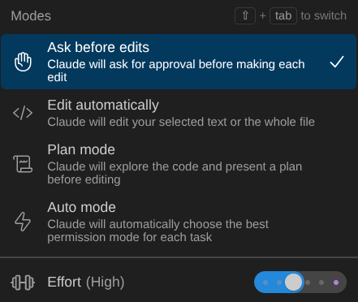
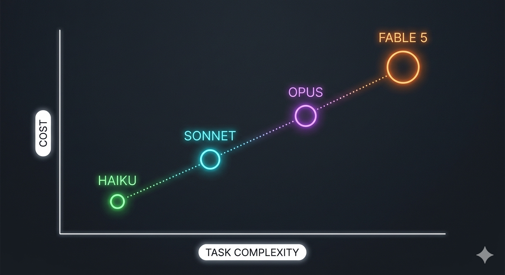
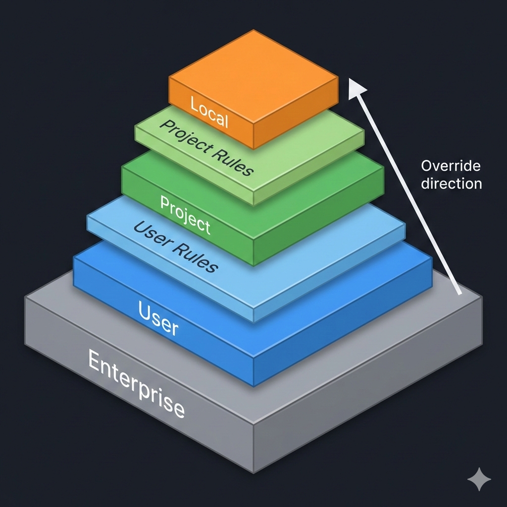
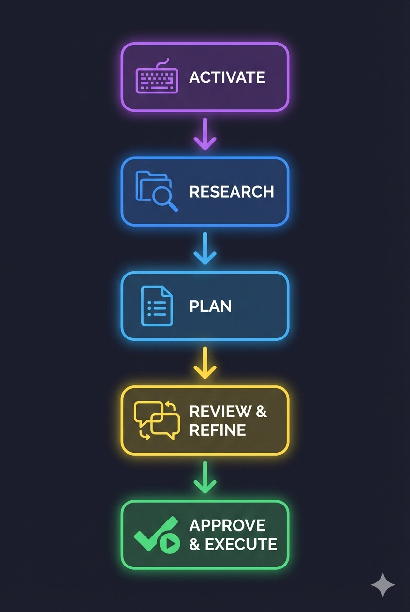
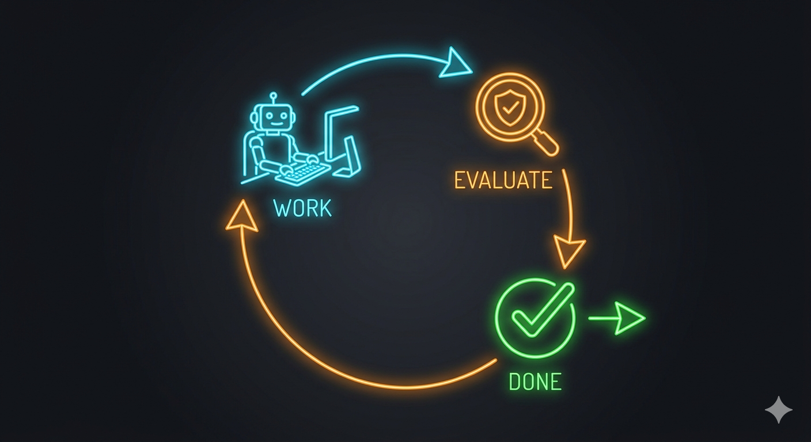
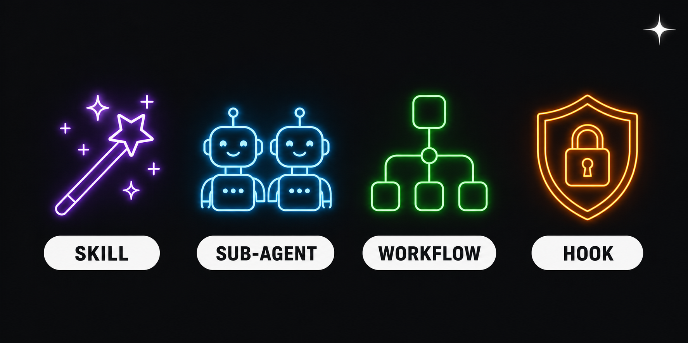
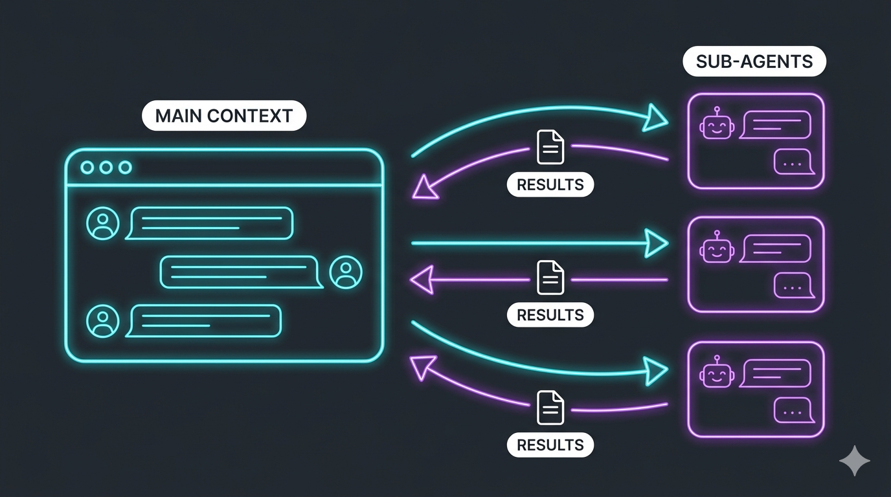
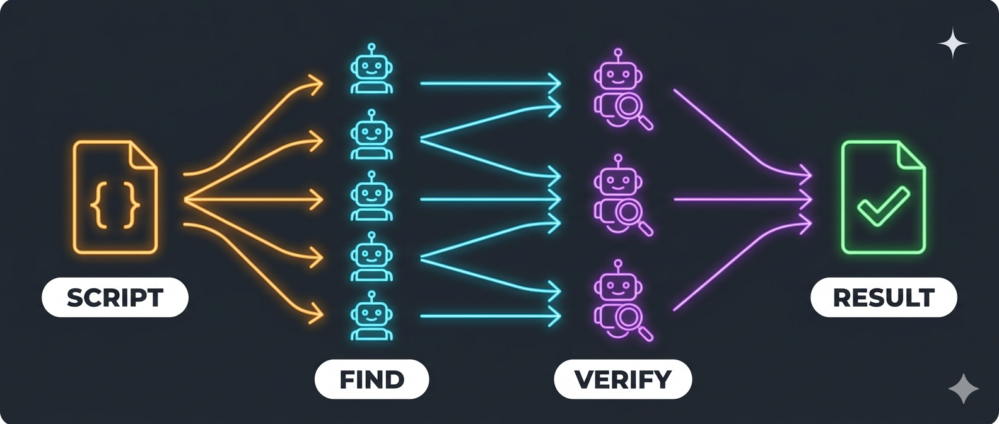
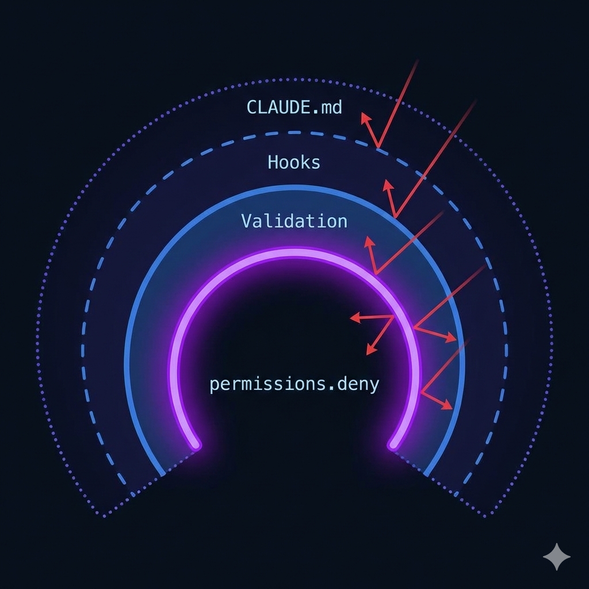
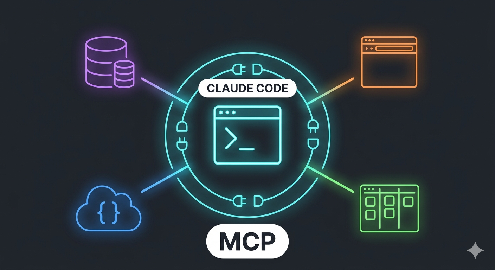

# Claude Code Fundamentals

<div align="center">


[](https://code.claude.com)
[](LICENSE)
[]()

**A comprehensive guide to Claude Code—Anthropic's agentic coding tool.**

[Getting Started](#what-is-claude-code) • [Models](#choosing-the-right-model) • [Memory](#claudemd-memory--configuration) • [Context](#context-management) • [Plan Mode](#plan-mode) • [Goals & Loops](#goals--loops-working-autonomously) • [Skills](#skills) • [Sub-Agents](#sub-agents) • [Workflows](#dynamic-workflows) • [Hooks](#hooks) • [Going Deeper](#going-deeper) • [Bonus Features](#bonus-features)

</div>

---

## Table of Contents

1. [What is Claude Code?](#what-is-claude-code)
2. [Choosing the Right Model](#choosing-the-right-model)
3. [CLAUDE.md: Memory & Configuration](#claudemd-memory--configuration)
4. [Context Management](#context-management)
5. [Plan Mode](#plan-mode)
6. [Goals & Loops: Working Autonomously](#goals--loops-working-autonomously)
7. [Extending Claude Code](#extending-claude-code)
    - [Skills](#skills)
    - [Sub-Agents](#sub-agents)
    - [Dynamic Workflows](#dynamic-workflows)
    - [Hooks](#hooks)
8. [Going Deeper](#going-deeper)
    - [MCP: Model Context Protocol](#mcp-model-context-protocol)
    - [API Key vs Subscription](#api-key-vs-subscription)
9. [Bonus Features](#bonus-features)
    - [Settings Optimization](#settings-optimization)
    - [Sandboxing](#sandboxing)
    - [Remote Control](#remote-control)
    - [Agent Teams](#agent-teams)

---

## What is Claude Code?

Claude Code is Anthropic's agentic coding tool that lives in your terminal. Unlike web-based AI chat interfaces that work with isolated code snippets, Claude Code understands your entire codebase and takes real action—running tests, fixing bugs, creating commits, and deploying code.

### Why Claude Code?

Since its release, Claude Code has been widely regarded as the most capable AI development tool available. Others have tried to replicate it—Cursor, Windsurf, Copilot agents—and they're solid tools, but they're not Claude Code.

If you want the sharpest tool in the shed, this is it.

| Capability                  | What It Means                                                  |
| --------------------------- | -------------------------------------------------------------- |
| **Full Codebase Awareness** | Reads your entire project structure, dependencies, and context |
| **Actually Executes**       | Runs tests, fixes bugs, creates commits—not just suggestions   |
| **Multi-File Operations**   | Coordinated changes across files while maintaining consistency |
| **Real-Time Context**       | Stays updated with your latest changes and git history         |

### Terminal vs IDE Extension

Claude Code runs in two main ways: the **CLI** in your terminal, and the official **VS Code extension** (there's a JetBrains plugin too). It's the same engine with the same configuration—your CLAUDE.md, skills, hooks, sub-agents, and settings work identically in both. The difference is the interface:

| | Terminal (CLI) | VS Code Extension |
| --- | --- | --- |
| **Reviewing changes** | Text diffs in the terminal | Native side-by-side diff viewer |
| **Giving context** | Type file paths | `@file.ts#5-10` mentions; your editor selection is shared automatically |
| **Plan Mode** | Plan as terminal text | Plan opens as a markdown doc you can comment on inline |
| **Checkpoints** | `/rewind` command | Hover any message to rewind code or fork the conversation |
| **Commands & skills** | Full set | Subset (type `/` to see what's available) |
| **Automation** | Headless `claude -p`, JSON output, CI pipelines | Not available |
| **Newest features** | Land here first (fast mode, agent teams) | Often arrive later or not at all |

**Rule of thumb:** the extension shines when you're reviewing Claude's changes visually and working file-by-file inside your editor. The terminal is the full-power surface—complete command set, automation, SSH/tmux workflows. Many developers use both: the extension for interactive feature work, the terminal for everything else.

> 💡 Installing the extension does **not** install the `claude` command—it bundles its own private copy of the CLI. Install the CLI separately for terminal use.
>
> See the extension in action in this [YouTube video](https://www.youtube.com/watch?v=0FmT0uasKWw)!

### Installation

Choose your preferred method:

```bash
# Recommended: Native binary (auto-updates)
curl -fsSL https://claude.ai/install.sh | bash

# macOS: Homebrew
brew install claude-code

# Windows: WinGet
winget install Anthropic.ClaudeCode

# Windows: PowerShell
irm https://claude.ai/install.ps1 | iex
```

After installation:

```bash
# Verify installation
claude doctor

# Start using Claude Code
cd your-project
claude
```

> 📝 **Note:** The npm method (`npm install -g @anthropic-ai/claude-code`) is **deprecated**. If migrating from npm, run `claude install` to switch to the native binary.

### Human-in-the-Loop: Permission Modes

Claude asks permission before executing commands. AI makes mistakes—always review before approving. Press **Shift+Tab** to cycle through modes depending on how much you want to supervise:



_The mode picker in the [VS Code extension](#terminal-vs-ide-extension); in the terminal the same modes cycle with Shift+Tab._

| Mode (UI label)            | aka            | What it does                                                              |
| -------------------------- | -------------- | ------------------------------------------------------------------------ |
| **Ask before edits**       | `default`      | Prompts on first use of each tool; reads run without asking              |
| **Edit automatically**     | `acceptEdits`  | Auto-approves file edits and routine filesystem commands in the working dir |
| **Plan mode**              | `plan`         | Claude explores and presents a plan—no edits until you approve (see [Plan Mode](#plan-mode)) |
| **Auto mode**              | `auto`         | Claude picks the best mode per task (research preview)                   |

Use `/permissions` to manage the rules behind these prompts: **allow** (never ask), **ask** (always confirm), and **deny** (block entirely). Deny wins over ask, which wins over allow.

> ⚠️ A `bypassPermissions` mode disables prompts entirely—only for isolated containers/VMs, and it's not in the normal Shift+Tab cycle (you opt in with a startup flag).

The same picker (shown above) also sets **Effort**—how much reasoning Claude spends per task. That's a separate knob from permissions; see [Effort Levels](#effort-levels) for when to dial it up or down.

### Essential Commands

| Command              | Purpose                                                          |
| -------------------- | ---------------------------------------------------------------- |
| `/help`              | Show all available commands                                      |
| `/clear`             | Reset conversation (keeps CLAUDE.md loaded)                      |
| `/compact`           | Compress conversation to save context                            |
| `/context`           | Visualize context window usage                                   |
| `/model`             | Switch between models ([see Choosing the Right Model](#choosing-the-right-model)) |
| `/effort` & `/fast`  | Tune reasoning depth and output speed ([see Choosing the Right Model](#choosing-the-right-model)) |
| `/goal`              | Keep working until a condition is met ([see Goals & Loops](#goals--loops-working-autonomously)) |
| `/loop`              | Re-run a prompt on an interval ([see Goals & Loops](#goals--loops-working-autonomously)) |
| `/workflows`         | Monitor running dynamic workflows ([see Dynamic Workflows](#dynamic-workflows)) |
| `/cd`                | Change working directory mid-session (without breaking the prompt cache) |
| `/account` & `/usage` | Show usage details for weekly limits                            |
| `/doctor`            | Diagnose installation issues                                     |

### Documentation & Guides

- [Claude Code Overview](https://code.claude.com/docs/en/overview) - Complete setup guide and feature documentation
- [Claude Code Best Practices](https://www.anthropic.com/engineering/claude-code-best-practices) - Tips and proven workflows from Anthropic's engineering team
- [Claude Code in Action](https://anthropic.skilljar.com/claude-code-in-action) - Interactive course with hands-on examples and use cases
- [Claude Code Sandboxing](https://www.develeap.com/claude-code-sandboxing-stop-babysitting-your-ai-assistant/) - Article and tutorial for running in a safe way

---

## Choosing the Right Model

Model choice is one of the highest-leverage decisions you make in Claude Code—it controls speed, cost, output quality, and how much autonomy you can safely hand over. Most people either always use the biggest model (burning through limits) or always use the default (leaving capability on the table). A little intentionality goes a long way.

<div align="center">



</div>

### The Current Lineup

| Model          | Alias    | API Price (in/out per Mtok) | Context             | Character                                                          |
| -------------- | -------- | --------------------------- | ------------------- | ----------------------------------------------------------------- |
| **Fable 5**    | `fable`  | $10 / $50                   | 1M                  | Most capable. Long autonomous runs, ambiguous "figure it out" work |
| **Opus 4.8**   | `opus`   | $5 / $25                    | 200K (1M via `opus[1m]`) | Deep reasoning, long-horizon agentic coding                  |
| **Sonnet 4.6** | `sonnet` | $3 / $15                    | 200K (1M via `sonnet[1m]`) | Best speed/intelligence balance—the daily driver           |
| **Haiku 4.5**  | `haiku`  | $1 / $5                     | 200K                | Fastest and cheapest. Scoped tasks, sub-agent workers              |

> 📝 The 1M-token window on `opus[1m]` is automatic on Max/Team/Enterprise plans. On a subscription you don't pay the per-token prices directly—they matter when using an API key or usage credits. See [API Key vs Subscription](#api-key-vs-subscription).

### The Decision Guide

| Task                                                  | Reach For                                  |
| ----------------------------------------------------- | ------------------------------------------ |
| Daily coding: features, bug fixes, moderate refactors | **Sonnet 4.6**                             |
| Architecture decisions, root-cause debugging, complex refactors | **Opus 4.8**                     |
| Ambiguous multi-day work where you'd normally break it up for a human | **Fable 5**                |
| Quick edits, lint fixes, simple transformations       | **Haiku 4.5**                              |
| Heavy planning, routine execution                     | **`opusplan`** (hybrid—see below)          |
| [Sub-agent](#sub-agents) fan-out workers              | **Haiku** workers, big-model orchestrator  |

**Two mental shortcuts:**

1. **Match the model to the ambiguity, not the size.** A 500-line mechanical rename is a Haiku/Sonnet job. A 10-line fix that requires understanding *why* the system behaves this way is an Opus/Fable job.
2. **Pay for the plan, not the typing.** Most of the value of a big model is in the decisions, not the code generation. That's exactly what `opusplan` exploits.

#### Fable 5, Mythos 5, and the "Mythos-class" Tier

Fable 5 and Mythos 5 (both released June 9, 2026) are **the same underlying model**—a fact the naming obscures. "Mythos-class" is the capability tier above Opus; the two names are two release channels of it:

| | Fable 5 | Mythos 5 |
| --- | --- | --- |
| **Who gets it** | Everyone (API, Claude Code, Bedrock, Vertex) | Approved orgs via **Project Glasswing** (cybersecurity & critical-infrastructure partners) |
| **Safeguards** | Safety classifiers for high-risk domains (offensive cyber, biology, model distillation) | Classifiers removed for authorized use |
| **Specs & pricing** | 1M context, $10/$50 per million tokens | Identical |

The classifiers behave differently than you might expect: when one triggers—on average in **under 5% of sessions**—Fable 5 doesn't refuse. The request transparently **falls back to Opus 4.8** and you see a notice. For everyday coding work you'll likely never hit one.

So for practical purposes: **Fable 5 is the Mythos-class model you can choose in Claude Code** (`/model fable`); Mythos 5 isn't something you'll ever see in the picker.

**Where Fable 5 actually earns its price:** its lead over Opus 4.8 grows with task difficulty—80.3% vs ~69% on SWE-Bench Pro, and roughly double Opus 4.8's scores on frontier-coding benchmarks. On simple, scoped work the gap is small, which is exactly why the decision guide above doesn't default to it.

> ⚠️ **Pricing window:** Fable 5 is included on Pro/Max/Team/Enterprise plans at no extra cost only through **June 22, 2026**. From June 23 it moves to usage credits (pay-as-you-go credits, separate from your plan limits) at $10/$50 per million tokens—budget accordingly before pointing long autonomous runs at it.

### Switching Models

```bash
/model            # interactive picker (Enter = save as default, s = this session only)
/model sonnet     # switch by alias
claude --model opus   # set at launch
```

Useful aliases beyond the basics:

| Alias        | Behavior                                                              |
| ------------ | --------------------------------------------------------------------- |
| `default`    | Clears your override—reverts to your plan's recommended model         |
| `best`       | Fable 5 if your account has access, otherwise latest Opus             |
| `opus[1m]` / `sonnet[1m]` | Extended 1M-token context window variants                |
| `opusplan`   | **Hybrid:** Opus while in [Plan Mode](#plan-mode), auto-switches to Sonnet for execution |

> 💡 **`opusplan` is the best default for most serious work.** You get Opus-quality architectural thinking during planning, then Sonnet-priced execution. The plan is where model quality matters most.

### Effort Levels

Newer models support an **effort** parameter that controls how deeply they reason—independent of which model you picked:

```bash
/effort low|medium|high|xhigh|max    # session-level
/effort auto                          # reset to default
```

| Level    | Use For                                                       |
| -------- | ------------------------------------------------------------- |
| `low`    | Latency-sensitive, simple tasks                                |
| `medium` | Cost-sensitive work—trades some depth for fewer tokens         |
| `high`   | The default—balanced                                           |
| `xhigh`  | Deeper reasoning at higher token spend                         |
| `max`    | No token constraint; session-only. Can overthink simple tasks  |

Haiku doesn't support effort levels. Skills and sub-agents can pin their own level with `effort:` in frontmatter.

> 📝 You'll also see `/effort ultracode`—not a reasoning level but a session mode that combines `xhigh` reasoning with automatic multi-agent orchestration. See [Dynamic Workflows](#dynamic-workflows).

### Fast Mode (`/fast`)

Fast mode is **not a smaller model**—it's the same Opus served with ~2.5x faster output, at roughly 2x the price ($10/$50 per million tokens on Opus 4.8—coincidentally the same price point as Fable 5, so at that rate, decide whether you want speed or capability). Toggle it with `/fast`.

| ✅ Use Fast Mode For                  | ❌ Skip It For                          |
| ------------------------------------- | --------------------------------------- |
| Live debugging, rapid iteration       | Long autonomous runs (cost compounds)   |
| Interactive pair-coding sessions      | Batch/background work                   |
| Time-critical fixes                   | Cost-sensitive work                     |

> ⚠️ Fast mode draws from **usage credits**, not your plan limits, and enabling it mid-conversation re-caches your history at fast-mode rates—turn it on at session start if you plan to use it.

### Models for Sub-Agents

Each [sub-agent](#sub-agents) can declare its own model in frontmatter (`model: haiku | sonnet | opus | inherit`). The classic cost pattern: **orchestrator on a big model, workers on Haiku.** A review fan-out with five Haiku workers costs a fraction of the same fan-out on Opus, and for scoped tasks ("check this file for X") the quality difference is usually negligible.

### Plan Limits and Model Choice

On Pro/Max plans, usage limits are shared between claude.ai chat and Claude Code, and bigger models consume them faster. Max plans have separate weekly caps for all-models vs Sonnet-only—meaning Sonnet work keeps flowing even after you exhaust the Opus budget. Check `/usage` before a long Opus/Fable session.

### Documentation & Guides

- [Model Configuration](https://code.claude.com/docs/en/model-config) - Aliases, effort levels, and environment overrides
- [Models Overview](https://platform.claude.com/docs/en/about-claude/models/overview) - Full comparison and pricing
- [Introducing Claude Fable 5 and Claude Mythos 5](https://platform.claude.com/docs/en/about-claude/models/introducing-claude-fable-5-and-claude-mythos-5) - Launch details, classifier behavior, and API changes
- [Fast Mode](https://code.claude.com/docs/en/fast-mode) - Setup and availability details

---

## CLAUDE.md: Memory & Configuration

CLAUDE.md is a special configuration file that gives Claude persistent knowledge about your project. Think of it as Claude's memory—information that stays consistent across all your coding sessions.

### The Memory Hierarchy

Claude Code loads memory files in order. **Later files override earlier ones:**

<div align="center">



</div>

| Load Order | Level             | Location                                         | Purpose                                   |
| ---------- | ----------------- | ------------------------------------------------ | ----------------------------------------- |
| 1 (first)  | **Enterprise**    | Managed settings or `/etc/claude-code/CLAUDE.md` | Org-wide policies (set by IT)             |
| 2          | **User**          | `~/.claude/CLAUDE.md`                            | Your personal standards for ALL projects  |
| 3          | **User Rules**    | `~/.claude/rules/*.md`                           | Modular personal rules                    |
| 4          | **Project**       | `./CLAUDE.md` or `./.claude/CLAUDE.md`           | Team-shared project instructions          |
| 5          | **Project Rules** | `./.claude/rules/*.md`                           | Modular project rules (with glob scoping) |
| 6 (last)   | **Local**         | `./CLAUDE.local.md`                              | Overrides all above                       |

> 📝 **Nested Discovery:** Claude also finds CLAUDE.md files in subdirectories. When working in `src/api/`, it loads both `./CLAUDE.md` and `./src/api/CLAUDE.md` automatically.

### Quick Setup Commands

| Command   | Purpose                                                |
| --------- | ------------------------------------------------------ |
| `/init`   | Generate a starter CLAUDE.md by analyzing your project |
| `/memory` | Open any memory file in your editor                    |
| `#`       | Quick-add a rule during a session                      |

### Global vs Project CLAUDE.md

| Global (`~/.claude/CLAUDE.md`)        | Project (`./CLAUDE.md`)         |
| ------------------------------------- | ------------------------------- |
| Your personal preferences             | This project's architecture     |
| Security rules (never commit secrets) | Team conventions                |
| Default project structures            | Project-specific commands       |
| Tools you always use                  | Environment setup for this repo |

### The Rules Directory

For larger projects, organize instructions into focused files using `.claude/rules/`:

```
your-project/
├── .claude/
│   ├── CLAUDE.md          # Main project instructions
│   └── rules/
│       ├── code-style.md  # Formatting conventions
│       ├── testing.md     # Test requirements
│       └── security.md    # Security policies
```

All `.md` files in `.claude/rules/` are automatically loaded as project memory.

### Importing External Files

CLAUDE.md files can import other documents using `@path/to/file` syntax:

```markdown
# Project Overview

See @README.md for project details.
See @docs/architecture.md for system design.

# Coding Standards

@docs/style-guide.md
```

This keeps your CLAUDE.md concise while giving Claude access to detailed documentation when needed.

### The Learning Loop

```
Claude makes mistake → You fix it → Update CLAUDE.md → Never happens again
```

This is **compounding engineering**: each fix makes all future work better. Mistakes become documentation.

#### The Mistake Log Pattern

When Claude makes a mistake, add a rule to prevent it:

| Scenario                            | CLAUDE.md Entry                                                       |
| ----------------------------------- | --------------------------------------------------------------------- |
| Claude used a deprecated method     | "Use fetch() instead of the deprecated request library"               |
| Claude committed to main directly   | "NEVER commit directly to main. Always create a feature branch first" |
| Claude forgot error handling        | "Always wrap async operations in try/catch blocks"                    |
| Claude used wrong naming convention | "Use camelCase for variables, PascalCase for components"              |

### Scaffolding: Your Project Factory

Your global CLAUDE.md can define project templates. When you say "create a new project," Claude automatically creates the correct structure.

```markdown
## New Project Structure

When creating ANY new project:

project/
├── src/ # Source code
├── tests/ # Test files
├── docs/ # Documentation
├── README.md # Must include: Overview, Setup, Usage
├── .gitignore # Standard exclusions
└── .claudeignore # Prevent token burn

### Requirements

- Always include a README with setup instructions
- Always include .gitignore and .claudeignore
- Use consistent naming conventions throughout
```

This eliminates project drift—every new project inherits your standards automatically.

### Protecting Sensitive Files

Claude can read files in your project. Be mindful of sensitive content:

| Type                    | Examples                                |
| ----------------------- | --------------------------------------- |
| **Environment files**   | `.env`, `.env.local`, `.env.production` |
| **Keys & credentials**  | `*.pem`, `id_rsa`, `credentials.json`   |
| **State files**         | `terraform.tfstate`, `*.tfstate.backup` |
| **Config with secrets** | API keys, database passwords            |

Add rules to your global CLAUDE.md:

```markdown
## Sensitive Files - NEVER Access

- .env, .env.\* (environment secrets)
- \*.pem, id_rsa, id_ed25519 (SSH keys)
- terraform.tfstate (contains plaintext secrets)
- credentials.json, \*-credentials.json
```

> ⚠️ **Important:** CLAUDE.md rules are behavioral guidelines—Claude tries to follow them, but they can be overridden under context pressure. For **hard enforcement**, use Hooks (see later) or `permissions.deny` in settings.

### Documentation & Guides

- [Manage Claude's memory](https://code.claude.com/docs/en/memory) - Advanced techniques for optimal context usage

---

## Context Management

Performance degrades when conversations get long and cluttered. Claude starts making assumptions based on outdated information from earlier in the chat. Clean context leads to accurate results.

### The Rule

> **"One Task, One Chat"**

Each conversation should focus on a single coherent task. When you switch tasks, start fresh.

### When to Reset

| Scenario                      | Action                  |
| ----------------------------- | ----------------------- |
| Starting a new feature        | New chat                |
| Switching to an unrelated bug | `/clear` or new chat    |
| Research vs implementation    | Separate chats          |
| 20+ turns elapsed             | Consider starting fresh |
| Claude seems confused         | `/clear`                |

### Why This Matters

Long conversations accumulate assumptions that become problems:

<div align="center">


</div>

| What Claude "Remembers"   | Reality                        | Risk                            |
| ------------------------- | ------------------------------ | ------------------------------- |
| File was named `utils.js` | You renamed it to `helpers.js` | Edits target wrong file         |
| Function had 3 parameters | You refactored to 2            | Incorrect function calls        |
| Using the old API         | You migrated to v2             | Generates incompatible code     |
| Package was installed     | You removed it                 | References missing dependencies |

### Context Commands

| Command    | What It Does                           | When to Use                 |
| ---------- | -------------------------------------- | --------------------------- |
| `/clear`   | Resets conversation, keeps CLAUDE.md   | Between tasks               |
| `/compact` | Summarizes and compresses conversation | Long task you must continue |

> 💡 **/clear keeps your rules.** It wipes chat history but does NOT forget what's in CLAUDE.md. Your project configuration stays intact—only the conversation resets.

> ⚠️ **Auto-compaction:** Claude Code compacts automatically as you approach the context limit (95% by default—see [Settings Optimization](#settings-optimization) to trigger it earlier). This can interrupt your flow—use `/clear` proactively between tasks to avoid it.

### /compact vs /clear

| Situation                          | Use        | Why                                     |
| ---------------------------------- | ---------- | --------------------------------------- |
| Task complete, starting new task   | `/clear`   | Fresh slate, no stale assumptions       |
| Long task, context getting bloated | `/compact` | Preserves essential info, reduces noise |
| Claude giving confused output      | `/clear`   | Fresh start is safer                    |
| Mid-task, need to free up tokens   | `/compact` | Keeps working context intact            |

### Persisting Context Across Sessions

Context resets when you start a new chat—but **files persist**. Use markdown files to maintain continuity across sessions:

| File                  | Purpose                            |
| --------------------- | ---------------------------------- |
| `project-progress.md` | What's done, what's next, blockers |
| `session-notes.md`    | Handoff notes between sessions     |

#### The /update Pattern

Create a simple skill to update your progress file:

```markdown
---
name: update
description: Update project progress file with current status
---

Update project-progress.md with:

1. What was accomplished this session
2. Current blockers or questions
3. Next steps

Keep it concise. Append to existing content with today's date.
```

**End sessions with:** `/update` or "Update the progress file with what we did"

**Start sessions with:** "Read project-progress.md and continue where we left off"

This gives you continuity without carrying stale context between sessions.

### The Bottom Line

A confused agent working with stale context makes mistakes. The few seconds you spend re-explaining a task after `/clear` are worth avoiding errors from outdated assumptions.

**When in doubt, start fresh.**

---

## Plan Mode

Plan Mode is a special operating mode where Claude can only research and analyze—it cannot make any changes until you approve. Think of it as putting Claude into "architect mode" where it observes, plans, and waits for your go-ahead.

### Why Plan Mode Matters

| Without Plan Mode                         | With Plan Mode                                         |
| ----------------------------------------- | ------------------------------------------------------ |
| Claude might start editing immediately    | Claude researches first, then presents a plan          |
| Changes happen as Claude thinks           | No changes until you explicitly approve                |
| Hard to course-correct mid-implementation | Easy to refine the approach before any code is written |
| Risk of unwanted modifications            | Completely safe exploration                            |

**The Pattern:** "Plan first, then execute" mirrors how senior engineers work—understand the problem thoroughly before writing code.

### When to Use Plan Mode

| ✅ Use Plan Mode                       | ❌ Skip Plan Mode                   |
| -------------------------------------- | ----------------------------------- |
| Multi-file implementations             | Quick single-file fixes             |
| Complex refactoring                    | Simple, well-understood changes     |
| Exploring unfamiliar codebases         | Tasks you've done many times        |
| Architecture decisions                 | Trivial updates                     |
| When you want to review before changes | When speed matters more than review |

### How It Works

In Plan Mode, Claude has access to **read-only tools only**:

| ✅ Available (Read-Only)   | ❌ Blocked (Write)        |
| -------------------------- | ------------------------- |
| Read files                 | Edit/Write files          |
| Directory listings (LS)    | Bash commands             |
| Grep/Glob searches         | File creation             |
| Web search/fetch           | Any state-modifying tools |
| Task (research sub-agents) | [MCP](#mcp-model-context-protocol) tools that modify |

Claude researches, analyzes, and creates a plan—then waits for your approval before touching anything.

### Activating Plan Mode

| Method                 | How                                                           |
| ---------------------- | ------------------------------------------------------------- |
| **During a session**   | Press `Shift+Tab` twice (cycles: Normal → Auto-Accept → Plan) |
| **Start in Plan Mode** | `claude --permission-mode plan`                               |
| **Headless query**     | `claude --permission-mode plan -p "Analyze the auth system"`  |

**Visual indicator:** When Plan Mode is active, you'll see `⏸ plan mode on` at the bottom of the terminal.

### The Plan Mode Workflow

<div align="center">



</div>

### Example: Planning a Refactor

```bash
# Start in Plan Mode
claude --permission-mode plan

> I need to refactor our authentication system to use OAuth2.
> Create a detailed migration plan.
```

Claude will:

1. Read existing auth code
2. Identify all files involved
3. Research dependencies
4. Present a step-by-step migration plan

**Refine with follow-ups:**

```
> What about backward compatibility?
> How should we handle existing sessions?
> What's the rollback strategy?
```

When satisfied, exit Plan Mode (`Shift+Tab`) and Claude will ask for confirmation before implementing.

### Best Practices

| Practice                     | Why                                    |
| ---------------------------- | -------------------------------------- |
| **Start broad, then narrow** | Let Claude explore before constraining |
| **Ask clarifying questions** | "What files will be modified?"         |
| **Request alternatives**     | "What are other approaches?"           |
| **Save important plans**     | Copy to `docs/PLAN.md` for reference   |
| **Don't skip review**        | The whole point is human verification  |

### Plan Mode vs. Spec-Driven Development

| Aspect        | Plan Mode                          | Spec-Driven (Spec Kit/BMAD)   |
| ------------- | ---------------------------------- | ----------------------------- |
| **Scope**     | Single task/session                | Full project lifecycle        |
| **Artifacts** | Temporary plan in Claude's context | Persistent spec documents     |
| **Process**   | Ad-hoc planning                    | Structured phases             |
| **Best for**  | Medium complexity tasks            | Large features, team projects |

> 💡 **Tip:** Plan Mode and spec-driven development complement each other. Use Plan Mode for individual implementation tasks within a larger spec-driven project.

### Documentation & Guides

- [Claude Code Common Workflows](https://code.claude.com/docs/en/common-workflows) - Official documentation including Plan Mode

---

## Goals & Loops: Working Autonomously

Plan Mode is about supervising Claude *before* work starts. These commands go the other direction: letting Claude keep working **without you prompting every turn**. Used well, they turn "babysitting an agent" into "checking in on a colleague."

### /goal — Work Until a Condition Is Met

`/goal` sets a completion condition, and Claude keeps taking turns until it's met. After each turn, a separate **evaluator** (a small, fast model—Haiku by default) checks whether the condition holds. If not, Claude automatically continues instead of returning control to you.

<div align="center">



</div>

```
/goal all tests in test/auth pass and the lint step is clean
```

| Command             | Effect                                                            |
| ------------------- | ----------------------------------------------------------------- |
| `/goal <condition>` | Set the goal and start working toward it                          |
| `/goal`             | Show status: elapsed time, turn count, token spend, evaluator's last reason |
| `/goal clear`       | Stop early (also accepts `stop`, `off`, `cancel`)                 |

**The key constraint:** the evaluator only sees the conversation transcript—it can't run tools. So your condition must be something Claude's own output can *demonstrate*: test results, build exit codes, file counts, an empty issue queue. "Tests pass" works (the test output lands in the transcript). "The feature feels polished" doesn't.

#### Writing Good Conditions

1. **One measurable end state** — `npm test exits 0`, `git status is clean`
2. **A stated check** — tell Claude how to prove it
3. **Constraints that matter** — "no other test file is modified"
4. **Bound the run** — "...or stop after 20 turns"

```
/goal every TODO in src/api is resolved, npm test exits 0,
      no files outside src/api are modified, or stop after 15 turns
```

#### /goal + Auto Mode = Unattended Runs

These compose: auto mode (the permission setting that auto-approves tool calls—cycle with `Shift+Tab`) approves **tools within a turn**, `/goal` approves **continuing to the next turn**. Together they let Claude run a long task end-to-end. For headless automation: `claude -p "/goal CHANGELOG.md has an entry for every PR merged this week"`.

> 📝 Goals survive `/resume` and work with `/compact`, but `/clear` removes them. Requires Claude Code v2.1.139+.

### /loop — Re-run on a Schedule

`/loop` repeats a prompt on a timer. Three modes:

| Usage                              | Behavior                                                                 |
| ---------------------------------- | ------------------------------------------------------------------------ |
| `/loop 10m check CI, fix failures` | Fixed interval (units: `s`, `m`, `h`, `d`)                                |
| `/loop check the deploy status`    | Claude picks and adjusts the interval itself (1 minute–1 hour)            |
| `/loop`                            | Built-in maintenance mode: tend the PR, fix CI, clean up                  |

- **Stop a loop:** press `Esc` while it's waiting for the next iteration.
- **Loops are session-scoped** and survive `/resume`, but recurring loops **auto-expire after 7 days**—a safety net so a forgotten loop can't drain your quota forever.
- **Customize bare `/loop`:** create `.claude/loop.md` (project) or `~/.claude/loop.md` (personal) with your own maintenance instructions.

> ⚠️ **Token cost is the catch.** Every iteration re-sends the conversation context. A loop polling every 5 minutes for hours adds up quietly. `/clear` before starting a long loop, and prefer the dynamic mode (no interval)—Claude spaces out checks based on what it observes instead of polling blindly.

| ✅ Good Loop Tasks                       | ❌ Bad Loop Tasks                                  |
| ---------------------------------------- | -------------------------------------------------- |
| Polling a deployment or CI run            | Unattended multi-day automation (use Routines)      |
| PR babysitting—address reviews, rebase    | Write-heavy work with nobody watching               |
| "Remind me at 3pm to push the release"    | Anything that should survive a machine restart      |

### Which One Do I Want?

| Mechanism | Driven By              | Best For                                      |
| --------- | ---------------------- | ---------------------------------------------- |
| `/goal`   | A completion condition | A finite task with a verifiable end state      |
| `/loop`   | A time interval        | Polling and recurring upkeep                   |
| **[Hook](#hooks)** | An event      | Deterministic enforcement, every time          |

### Beyond Your Machine: Scheduled Routines

`/loop` dies with your session. **Routines** run in Anthropic's cloud on a schedule—your machine can be off entirely:

```
/schedule daily PR review at 9am
/schedule list
```

Each run is a fresh cloud session:

- Your repo is **cloned fresh** and the prompt executes autonomously—no permission prompts
- Pushes go to `claude/*`-prefixed branches by default (a safety boundary)
- Triggers: cron schedules (minimum 1 hour), API calls, or GitHub events (PR opened, release published)
- Available on Pro/Max/Team/Enterprise as a research preview

| Dimension          | `/loop`            | Routines              |
| ------------------ | ------------------ | --------------------- |
| Runs on            | Your machine       | Anthropic's cloud     |
| Machine must be on | Yes                | No                    |
| Minimum interval   | 1 minute           | 1 hour                |
| Local file access  | Yes                | No (fresh clone)      |

### Documentation & Guides

- [Keep Claude Working Toward a Goal](https://code.claude.com/docs/en/goal) - Official /goal documentation
- [Scheduled Tasks](https://code.claude.com/docs/en/scheduled-tasks) - /loop, cron syntax, and expiry rules
- [Routines](https://code.claude.com/docs/en/routines) - Cloud-scheduled agents

---

## Extending Claude Code

Claude Code can be extended beyond CLAUDE.md with four mechanisms. This section summarizes when to use each—the following sections cover details.

<div align="center">



</div>

### The Four Mechanisms

| Mechanism            | Type          | Runs When                                          | Best For                            |
| -------------------- | ------------- | --------------------------------------------------- | ----------------------------------- |
| **Skill**            | AI-driven     | You invoke (`/skill`) or Claude auto-triggers       | Reusable workflows                  |
| **Sub-Agent**        | AI-driven     | Claude delegates, or you invoke                     | Parallel/isolated work              |
| **Dynamic Workflow** | Scripted      | You opt in (`ultracode` keyword or saved workflow)  | Large-scale multi-agent orchestration |
| **Hook**             | Deterministic | Always, on specific events                          | Enforcement, validation             |

### Quick Decision Guide

| "I want Claude to..."                        | Use                      |
| -------------------------------------------- | ------------------------ |
| Follow a workflow when I ask                 | **Skill** (`/command`)   |
| Auto-apply expertise based on context        | **Skill** (auto-trigger) |
| Do heavy analysis without cluttering my chat | **Sub-Agent**            |
| Work on multiple things in parallel          | **Sub-Agent**            |
| Audit/migrate/review at a scale one agent can't hold | **Dynamic Workflow** |
| ALWAYS run a check, no exceptions            | **Hook**                 |
| Block dangerous operations deterministically | **Hook**                 |

### The Key Distinction

|                    | Skills & Sub-Agents              | Hooks                    |
| ------------------ | -------------------------------- | ------------------------ |
| **Control**        | AI decides how/when              | You define exactly when  |
| **Flexibility**    | Adapts to context                | Same behavior every time |
| **Can be skipped** | Yes, if Claude deems unnecessary | No, always runs          |

> 📝 Dynamic Workflows sit between the two camps: AI plans the structure, but once you approve the script it executes deterministically—agents run as written, not as re-decided.

---

## Skills

Skills are reusable instructions that extend Claude's capabilities. They can be invoked explicitly (`/skill-name`) or triggered automatically based on context.

> 📝 **In early 2026, Commands merged with Skills.** Files at `.claude/commands/` and `.claude/skills/` both work the same way.

### How Skills Work

1. **At startup:** Only skill names and descriptions are loaded (saves tokens)
2. **When triggered:** Full skill content loads into context
3. **Execution:** Claude follows the skill's instructions
4. **Completion:** Skill content can be unloaded

This "progressive disclosure" keeps your context lean until expertise is actually needed.

> ⚠️ **Skill character budget:** Descriptions scale with context window (~2% of context). If you have many skills, some may be excluded. Run `/context` to check for warnings.

### Creating Skills

There are several ways to create a skill:

| Method              | How                                                                    |
| ------------------- | ---------------------------------------------------------------------- |
| **Ask Claude Code** | "Create a skill for reviewing pull requests"                           |
| **Skill Builder**   | Visual editor in Claude Desktop/Web (Settings → Capabilities → Skills) |
| **Manually**        | Create files in `.claude/skills/` directory                            |

#### Skill Locations

- `.claude/skills/skill-name/` — Project skills (shared with team)
- `~/.claude/skills/skill-name/` — Personal skills (all projects)

### Skill Structure

A skill is a **folder**, not just a single file. It can contain multiple resources:

```
.claude/skills/code-review/
├── SKILL.md           # Main instructions (required)
├── checklist.md       # Additional documentation
├── validate.py        # Helper script
└── templates/
    └── report.md      # Template files
```

Claude can access all files in the skill folder when the skill is active.

#### SKILL.md (Required)

```markdown
---
name: code-review
description: Review code for quality and best practices
---

When reviewing code:

1. Check for security issues
2. Verify error handling
3. Look for code duplication
4. Check for missing tests
```

> 💡 **The `description` is the trigger.** Make it specific — Claude uses this to decide when to auto-activate the skill. Anthropic notes that Claude tends to "undertrigger," so be a little pushy in descriptions (e.g., "Use this skill whenever the user mentions code quality, refactoring, or asks for a review").

### Frontmatter Options

| Option                     | Purpose                                                  | Example                      |
| -------------------------- | -------------------------------------------------------- | ---------------------------- |
| `name`                     | Creates `/name` command                                  | `code-review`                |
| `description`              | When to auto-trigger                                     | `Review code for quality...` |
| `allowed-tools`            | Restrict available tools                                 | `Read, Grep, Glob`           |
| `model`                    | Use specific model                                       | `sonnet`, `opus`, `haiku`    |
| `effort`                   | Pin reasoning effort for this skill                      | `low`, `medium`, `high`, `xhigh` |
| `argument-hint`            | Shown in autocomplete after `/name`                      | `[file-path]`                |
| `disable-model-invocation` | User-only — no auto-trigger                              | `true`                       |
| `user-invocable`           | Set `false` to hide from `/` menu (background knowledge) | `false`                      |
| `context`                  | Set `fork` to run in isolated subagent context           | `fork`                       |

### Arguments and Dynamic Content

Skills can accept user input and inject live data:

| Syntax           | What It Does                         | Example                                    |
| ---------------- | ------------------------------------ | ------------------------------------------ |
| `$ARGUMENTS`     | Everything typed after `/skill-name` | `/deploy staging` → `$ARGUMENTS` = staging |
| `$0`, `$1`, `$2` | Positional arguments                 | `/fix-issue 42` → `$0` = 42                |
| `` !`command` `` | Inject bash output into prompt       | `` !`git status` ``                        |
| `@path/to/file`  | Inject file contents into prompt     | `@README.md`                               |

Example using dynamic content:

```markdown
---
name: pr-status
description: Summarize current PR changes
---

Current changes:
!`git diff --stat`

Summarize the changes above and suggest a PR title.
```

### Naming Convention

Use prefixes to organize your `/` menu:

| Prefix    | Examples                   |
| --------- | -------------------------- |
| `review-` | `review-code`, `review-pr` |
| `gen-`    | `gen-readme`, `gen-tests`  |
| `fix-`    | `fix-lint`, `fix-types`    |

### Bundled Skills

Claude Code ships with built-in skills available in every session:

| Skill                  | What It Does                                                                                                                                                                                            |
| ---------------------- | ------------------------------------------------------------------------------------------------------------------------------------------------------------------------------------------------------- |
| `/simplify`            | Reviews recently changed files for code reuse, quality, and efficiency. Spawns 3 parallel review agents, aggregates findings, applies fixes. Pass text to focus: `/simplify focus on memory efficiency` |
| `/batch <instruction>` | Orchestrates large-scale changes across a codebase. Decomposes work into 5–30 independent units, spawns one agent per unit in isolated git worktrees                                                    |
| `/claude-api`          | Loads Claude API reference for your project's language. Also auto-activates when your code imports Anthropic SDKs                                                                                       |
| `/deep-research <question>` | Bundled dynamic workflow: fans out web searches, fetches and cross-checks sources, returns a cited report (see [Dynamic Workflows](#dynamic-workflows))                                            |

### Skill Example: Dockerfile Generator

```markdown
---
name: gen-dockerfile
description: Generate production-ready Dockerfiles with security best practices
argument-hint: [application-type]
---

# Dockerfile Generator

Generate a production-ready Dockerfile following these standards:

## Base Image

- Use specific version tags, never `latest`
- Prefer minimal base images (alpine, distroless, slim)

## Security

- Run as non-root user
- No secrets in build args or environment
- Use multi-stage builds

## Optimization

- Order commands for optimal layer caching
- Combine RUN commands to reduce layers
- Clean up package manager caches

Always ask what type of application before generating.
```

### When NOT to Use Skills

| Situation                            | Better Alternative       |
| ------------------------------------ | ------------------------ |
| Instructions for every conversation  | Put in CLAUDE.md         |
| Must run every time, no exceptions   | Use a Hook               |
| Heavy analysis that blocks main work | Use a Sub-Agent          |
| Simple one-off task                  | Just ask Claude directly |

### Included Skills

This repo ships with ready-to-use skills in [`.claude/skills/`](.claude/skills/). Clone the repo and they work immediately as `/slash-commands`:

| Command          | Description                                                                                 |
| ---------------- | ------------------------------------------------------------------------------------------- |
| `/commit`        | Conventional commit messages with a confirmation step before writing                        |
| `/drawio`        | Generate native `.drawio` diagrams for VS Code or app.diagrams.net                          |
| `/html-guide`    | Convert a markdown runbook/guide into a styled, self-contained HTML page (LTR + Hebrew RTL) |
| `/skill-creator` | Create, edit, and benchmark skills; optimize descriptions for triggering accuracy           |
| `/remind`        | Ten-second briefing of what this session is doing and what it needs from you                |
| `/update`        | Update a PROGRESS.md file with session changes                                              |

### Documentation & Guides

- [Skills Documentation](https://code.claude.com/docs/en/skills) - Official guide to creating and managing skills
- [Claude Code Tutorials](https://docs.anthropic.com/en/docs/claude-code/tutorials) - Examples including skill creation
- [Agent-Skills.md](https://agent-skills.md/) - Skills Marketplace
- [YouTube Video](https://www.youtube.com/watch?v=-OnvD9McDt8) - Tutorial By Sean Kochel

---

## Sub-Agents

Sub-agents are specialized Claude instances that work in **isolated context**. They don't see or affect your main conversation until they finish and report back.

<div align="center">



</div>

### Why Isolation Matters

| Main Conversation                       | Sub-Agent                             |
| --------------------------------------- | ------------------------------------- |
| Sees your full chat history             | Starts fresh with its own context     |
| Changes affect your context immediately | Changes are isolated until completion |
| Context grows with every interaction    | Context stays focused on its task     |

This isolation is powerful for:

- **Parallel work** — Multiple agents working simultaneously
- **Heavy analysis** — Without bloating your main context
- **Experimental changes** — Try risky refactors safely
- **Sensitive tasks** — Security audits that shouldn't see WIP code

### Built-in Sub-Agents

Claude Code includes automatic sub-agents you don't configure:

| Agent               | Purpose                    | Triggers When                                              |
| ------------------- | -------------------------- | ---------------------------------------------------------- |
| **Explore**         | Read-only codebase search  | Claude needs to find/understand code without modifications |
| **Plan**            | Research for planning mode | Gathering context before presenting a plan                 |
| **general-purpose** | Complex multi-step tasks   | Tasks requiring both exploration and modification          |

These activate automatically based on task complexity—you'll see them working in the UI.

### Managing Sub-Agents

| Command          | Purpose                                 |
| ---------------- | --------------------------------------- |
| `/agents`        | Open agent management menu              |
| `/agents list`   | See all available agents                |
| `/agents create` | Create a new agent (interactive wizard) |

### Creating Custom Sub-Agents

Sub-agents live in:

- `.claude/agents/agent-name.md` — Project agents (shared with team)
- `~/.claude/agents/agent-name.md` — Personal agents (all projects)

#### Basic Structure - Example

```markdown
---
name: security-reviewer
description: Review code for security issues
model: sonnet
tools: Read, Grep, Glob
---

You are a security-focused reviewer. Check for:

1. Hardcoded secrets
2. Injection vulnerabilities
3. Missing authentication
```

#### Configuration Options

`name` and `description` are required. The most useful optional fields:

| Option            | Purpose                                  | Values                                                       |
| ----------------- | ---------------------------------------- | ------------------------------------------------------------ |
| `model`           | Which Claude model                       | `opus`, `sonnet`, `haiku`, `fable`, `inherit` (parent's)     |
| `tools`           | Available tools (inherits all if omitted) | `Read`, `Write`, `Bash`, `Grep`, `Glob`, etc.               |
| `permissionMode`  | Default permission mode for the agent    | `default`, `acceptEdits`, `plan`, `bypassPermissions`, etc.  |
| `memory`          | Persistent memory scope (see below)      | `user`, `project`, `local`                                   |
| `hooks`           | Agent-specific hooks                     | Hook configuration (see Hooks section)                       |
| `color`           | UI identifier                            | `blue`, `orange`, `red`, `green`, `purple`                   |

> 💡 **Cost pattern:** put review/worker agents on `haiku` and keep the big model for the main session. For scoped tasks the quality difference is small; the cost difference isn't. See [Models for Sub-Agents](#models-for-sub-agents).

> 📝 **Persistent memory:** add `memory: project` (or `user`/`local`) and the agent reads and writes a memory directory across sessions—so it remembers your conventions instead of starting cold each time.

#### Tool Restrictions

Limit tools for safety:

| Agent Type       | Recommended Tools                        |
| ---------------- | ---------------------------------------- |
| Reviewer/Auditor | `Read`, `Grep`, `Glob` (no write access) |
| Generator        | `Read`, `Write`, `Grep`, `Glob`          |
| Full automation  | All tools including `Bash`               |

### Async Execution

Sub-agents can run in the background:

1. Start a sub-agent task
2. Press `Ctrl+B` to background it
3. Continue your main work
4. Agent reports back when done

This is great for long-running analysis while you continue coding.

> 📝 **Nested sub-agents:** as of mid-2026, sub-agents can spawn their own sub-agents (up to 5 levels deep)—enabling hierarchical delegation, like an orchestrator that spawns researchers that spawn specialists.

### Agent View

Once you've backgrounded an agent with `Ctrl+B`, where does it go? Run `claude agents` to open **agent view**—a dashboard of your background sessions, each showing its status (working / needs input / done / failed), a one-line summary, elapsed time, and any associated PR. From there you can peek at output, attach to a session, or stop it.

For scripting, `claude agents --json` prints the active sessions (add `--all` for completed ones)—handy for status checks in your own tooling.

Don't confuse it with two similarly-named things: `/agents` manages your sub-agent **definitions**, and `/workflows` monitors **workflow** runs. Agent view is specifically about background **sessions**.

> 📝 Agent view is a **research preview** (requires Claude Code v2.1.139+).

### Sub-Agent Example: Documentation Generator

An agent for generating and updating documentation:

```markdown
---
name: docs-generator
description: Generate and update project documentation
model: sonnet
tools: Read, Write, Grep, Glob
color: blue
---

# Documentation Generator

You create and maintain project documentation.

## Documentation Types

### README.md

- Project overview and purpose
- Prerequisites and requirements
- Installation instructions
- Quick start guide
- Configuration options
- Usage examples
- Contributing guidelines
- License information

### API Documentation

- Endpoint descriptions
- Request/response formats
- Authentication requirements
- Error codes and handling
- Example requests with curl

### Architecture Documentation

- System overview diagram (Mermaid)
- Component descriptions
- Data flow
- Infrastructure layout
- Key design decisions

### Runbooks

- Common operations procedures
- Troubleshooting guides
- Incident response steps
- Deployment procedures

## Style Guidelines

- Write for the target audience (developers, ops, users)
- Include practical examples
- Keep it concise but complete
- Use consistent formatting
- Include diagrams where helpful (Mermaid syntax)

## Process

1. Analyze the codebase structure
2. Identify what documentation exists
3. Determine what's missing or outdated
4. Generate/update documentation
5. Ensure consistency across docs

Ask what type of documentation is needed before starting.
```

### When to Use Sub-Agents

| Situation                              | Use Sub-Agent?         |
| -------------------------------------- | ---------------------- |
| Heavy analysis without blocking        | ✅ Yes                 |
| Parallel work                          | ✅ Yes                 |
| Experimental/risky changes             | ✅ Yes                 |
| Quick, simple task                     | ❌ No, just ask Claude |
| Need immediate changes in main context | ❌ No, use Skill       |

### Sub-Agent Best Practices

**DO:**

- Give agents focused, single purposes
- Use read-only tools for review/audit agents
- Use descriptive names and colors
- Include clear output format expectations

**DON'T:**

- Run too many agents at once (3-4 is usually enough)
- Give audit agents write permissions
- Use agents for simple tasks (overhead not worth it)
- Expect agents to share state with main conversation

### Included Agent

This repo ships with one example agent in [`.claude/agents/`](.claude/agents/) that demonstrates the audit-agent pattern:

| Agent         | Model  | Tools                  | Purpose                                                                       |
| ------------- | ------ | ---------------------- | ----------------------------------------------------------------------------- |
| `pr-reviewer` | Sonnet | Read, Grep, Glob, Bash | Review uncommitted changes or a diff — surface bugs, security issues, missing tests, breaking changes |

It's intentionally **read-only** (no Write/Edit). The point of an independent reviewer is to surface findings, not "just fix it" — a reviewer that can edit is no longer a reviewer. See [pr-reviewer.md](.claude/agents/pr-reviewer.md) for the full prompt; it's a good starting template for your own audit agents.

### Documentation & Guides

- [Sub-Agents Documentation](https://docs.anthropic.com/en/docs/claude-code/sub-agents) - Complete guide to creating specialized agents
- [How to create and use Subagents in Claude Code](https://www.cometapi.com/how-to-create-and-use-subagents-in-claude-code/) - A practical guide
- [YouTube Video](https://www.youtube.com/watch?v=mEt-i8FunG8) - Sub-Agents overview in 10 Minutes

---

## Dynamic Workflows

Dynamic Workflows (mid-2026) are the newest orchestration layer. You describe a task, Claude writes a **JavaScript orchestration script**, and a separate runtime executes it in the background—spawning dozens to hundreds of sub-agents deterministically while your session stays responsive.

<div align="center">



</div>

**The mental shift:** with sub-agents, Claude decides what to spawn turn by turn, and every intermediate result flows back through its context. With workflows, *the plan moves out of Claude's head and into a script*—loops, fan-outs, and verification passes are encoded as code, and intermediate results live in script variables instead of the context window.

### When a Workflow Beats a Sub-Agent

| Situation                                                   | Why a Workflow                                        |
| ----------------------------------------------------------- | ----------------------------------------------------- |
| Audit every API endpoint / migrate every call site          | Work-list too large for one context window            |
| "Find bugs and *verify* each one before reporting"          | Adversarial verification needs structured fan-out     |
| Repeatable multi-stage process you'll run again             | Save the script, re-run as a `/command`               |
| Research that needs multiple independent search angles      | Parallel sweeps with a synthesis stage                |

For a quick isolated task—"review this file," "summarize these logs"—a plain sub-agent is still the right tool. Workflows shine when the *structure* of the work (fan out, verify, synthesize, loop until done) matters.

> 📝 Already using `/batch`? That bundled skill is a fixed decompose-and-edit recipe. Dynamic Workflows generalize the idea: arbitrary structure, verification stages, and scripts you can save and re-run.

### Triggering a Workflow

Workflows are **opt-in by design**—they can spawn many agents and burn serious tokens, so Claude won't launch one unless you ask:

| Method               | How                                                                       |
| -------------------- | ------------------------------------------------------------------------- |
| **One-off**          | Include the keyword `ultracode` in your prompt                            |
| **Session-wide**     | `/effort ultracode` — every substantive task gets workflow treatment      |
| **In your own words**| "use a workflow", "fan out agents", "orchestrate this with sub-agents"    |
| **Saved workflow**   | `/<workflow-name>` from `.claude/workflows/` or `~/.claude/workflows/`    |
| **Bundled**          | `/deep-research <question>`                                               |

```
ultracode: audit every endpoint under src/routes/ for missing auth checks
```

> 💡 Typed `ultracode` by accident? Press `Option+W` / `Alt+W` to dismiss it.

### Anatomy of a Workflow Script

You rarely write these by hand—Claude generates them—but reading one demystifies the feature:

```javascript
export const meta = {
  name: 'audit-auth',
  description: 'Audit API routes for missing auth checks',
  phases: [{ title: 'Find' }, { title: 'Verify' }],
}

phase('Find')
const findings = await parallel(routes.map(r => () =>
  agent(`Check ${r} for missing auth checks`, { phase: 'Find' })))

phase('Verify')
// every finding gets an independent skeptic before it reaches the report
const confirmed = await parallel(findings.filter(Boolean).map(f => () =>
  agent(`Try to refute this finding: ${f}`, { phase: 'Verify' })))

return confirmed
```

| Primitive    | What It Does                                                        |
| ------------ | -------------------------------------------------------------------- |
| `agent()`    | Spawn one sub-agent; can return validated JSON via a schema          |
| `parallel()` | Run tasks concurrently, wait for all (a barrier)                     |
| `pipeline()` | Stream items through stages with no barrier—fastest for multi-stage  |
| `phase()` / `log()` | Group progress / narrate status in the UI                      |
| `args` / `budget` | Input parameters / token-budget tracking                        |

The killer pattern this enables is **adversarial verification**: one wave of agents finds issues, a second wave of independent skeptics tries to refute each finding, and only survivors reach you. That's how workflow-driven reviews avoid plausible-but-wrong findings.

### Monitoring and Reusing

- **`/workflows`** shows live progress: phases, per-agent token usage, elapsed time. From there you can pause (`p`), stop (`x`), or **save the run's script (`s`)**.
- Saved scripts land in `.claude/workflows/` (project, shared via git) or `~/.claude/workflows/` (personal) and become `/commands`.
- Interrupted runs are **resumable in the same session**—completed agents return cached results; only the rest re-run.

### Guardrails & Cost

| Guardrail                  | Detail                                                          |
| -------------------------- | ---------------------------------------------------------------- |
| Concurrency cap            | ~16 agents at once (queued beyond that)                          |
| Per-run cap                | 1,000 agents total—a runaway-loop backstop                       |
| Approval prompt            | Every run shows planned phases before starting                   |
| Worktree isolation         | `isolation: 'worktree'` gives agents separate git worktrees when they edit the same files in parallel |
| Kill switch                | `"disableWorkflows": true` in settings, or `CLAUDE_CODE_DISABLE_WORKFLOWS=1` |

> ⚠️ **Workflows are token-hungry by nature.** A single run can use more tokens than a full day of normal sessions. Start with a narrow slice (one directory, one question) to gauge spend before pointing a workflow at the whole repo. `/workflows` shows you the bill as it accumulates.

> 📝 **Proof of scale:** the Bun runtime's Zig→Rust migration—roughly 750,000 lines in 11 days—was driven by dynamic workflows running hundreds of parallel agents in isolated worktrees.

### Workflows vs Sub-Agents vs Agent Teams

| Aspect              | Sub-Agents             | [Agent Teams](#agent-teams) (experimental) | Dynamic Workflows |
| ------------------- | ---------------------- | ---------------------------- | -------------------------------- |
| **Who plans**       | Claude, turn by turn   | Team lead, turn by turn      | The script itself                |
| **Results live in** | Claude's context       | Shared task list + messages  | Script variables                 |
| **Scale**           | A few per turn         | A handful of peers           | Dozens to hundreds per run       |
| **Best for**        | Isolated focused tasks | Collaboration & discussion   | Structured fan-out + verification |

### Documentation & Guides

- [Dynamic Workflows Documentation](https://code.claude.com/docs/en/workflows) - Primitives, saving, permissions
- [Introducing Dynamic Workflows](https://claude.com/blog/introducing-dynamic-workflows-in-claude-code) - Official announcement
- [A Harness for Every Task](https://claude.com/blog/a-harness-for-every-task-dynamic-workflows-in-claude-code) - Workflow patterns from Anthropic

---

## Hooks

Hooks are **deterministic guardrails**—they always run when triggered, no exceptions. Unlike CLAUDE.md rules (suggestions) or Skills (AI-driven), hooks execute automatically on specific events.

### The Key Distinction

| Mechanism       | Type                   | Can Be Skipped?                  |
| --------------- | ---------------------- | -------------------------------- |
| CLAUDE.md rules | Behavioral suggestion  | Yes, under context pressure      |
| Skills          | AI-driven workflow     | Yes, if Claude deems unnecessary |
| **Hooks**       | **Deterministic code** | **No, always executes**          |

**When to use hooks:** If you find yourself writing "NEVER" or "ALWAYS" in CLAUDE.md and it's critical, make it a hook instead.

### Privacy Advantage

Hooks run **locally on your machine**. No data leaves your environment—ideal for sensitive infrastructure code, proprietary business logic, and compliance-restricted environments.

### Hook Events

| Event                | When It Fires                    | Common Uses                         |
| -------------------- | -------------------------------- | ----------------------------------- |
| `SessionStart`       | Claude Code starts               | Load environment, validate setup    |
| `UserPromptSubmit`   | Before processing prompt         | Enrich or validate user input       |
| `PreToolUse`         | Before tool executes             | Block dangerous ops, modify inputs  |
| `PostToolUse`        | After tool succeeds              | Run linters, validators, formatters |
| `PostToolUseFailure` | After tool fails                 | Error handling, cleanup             |
| `PermissionRequest`  | Permission prompt shown          | Auto-approve/deny based on patterns |
| `Stop`               | Claude finishes turn             | Final quality checks                |
| `SubagentStart`      | Spawning a sub-agent             | Track launches, enforce limits      |
| `SubagentStop`       | Sub-agent completes              | Coordinate between agents           |
| `PreCompact`         | Before context compaction        | Preserve critical info              |
| `Setup`              | With `--init` or `--maintenance` | One-time setup tasks                |
| `Notification`       | Claude sends notifications       | Custom alerts (Slack, Discord)      |
| `SessionEnd`         | Session terminates               | Cleanup tasks                       |

### Exit Codes & Decisions

| Code  | Meaning                 | Claude's Response                           |
| ----- | ----------------------- | ------------------------------------------- |
| 0     | Allow operation         | Continues normally                          |
| 1     | Error                   | Shows error to user, may retry              |
| **2** | **Block with feedback** | **Stops operation, Claude adapts approach** |

Hooks can also return a `permissionDecision` in their JSON output:

| Decision  | Effect                                        |
| --------- | --------------------------------------------- |
| `"allow"` | Bypass permission dialog, execute immediately |
| `"deny"`  | Block operation, show reason to Claude        |
| `"ask"`   | Show permission dialog to user                |

> 💡 **Exit code 2 is your friend.** It tells Claude _why_ the operation was blocked, so it can try a different approach. Exit 1 looks like a crash.

### Configuration

Hooks are defined in settings files with a clear hierarchy:

| Location                      | Scope                        |
| ----------------------------- | ---------------------------- |
| `~/.claude/settings.json`     | Global (all projects)        |
| `.claude/settings.json`       | Project (shared via git)     |
| `.claude/settings.local.json` | Local overrides (gitignored) |

#### Basic Structure

```json
{
  "hooks": {
    "PreToolUse": [
      {
        "matcher": "Read|Edit|Write",
        "hooks": [
          {
            "type": "command",
            "command": "bash ~/.claude/hooks/block-secrets.sh"
          }
        ]
      }
    ]
  }
}
```

**Matcher patterns** use regex to match tool names:

| Matcher               | Matches            |
| --------------------- | ------------------ |
| `"Read"`              | Read tool only     |
| `"Read\|Write\|Edit"` | Any of these tools |
| `".*"`                | All tools          |
| `"Bash"`              | Bash commands      |

Use `/hooks` during a session for interactive management.

### Performance

Hooks run synchronously—Claude waits for them. `PreToolUse` fires on _every_ tool call.

| Language | Startup Time | Best For                                        |
| -------- | ------------ | ----------------------------------------------- |
| Bash     | ~10-20ms     | Simple operations                               |
| Node.js  | ~50-100ms    | High-frequency events (PreToolUse, PostToolUse) |
| Python   | ~200-400ms   | Infrequent events (SessionStart), debugging     |

**Keep hooks fast and idempotent.** Anything over 100ms adds noticeable latency. Test hooks thoroughly before relying on them in production.

### Starter Kit: Try It Yourself

Download ready-to-use safety hooks from the [`.claude/hooks/`](.claude/hooks/) folder:

**Included hooks:**

- **block-dangerous-commands.js** — Blocks `rm -rf ~`, fork bombs, `curl | sh`, force-push to main
- **protect-secrets.js** — Blocks access to `.env`, SSH keys, cloud credentials, tfstate files

Both hooks have configurable safety levels (critical, high, strict) and log all blocked operations to `~/.claude/hooks-logs/`.

See the [Hooks README](.claude/hooks/README.md) for installation instructions.

### Defense in Depth

Layer multiple protection mechanisms:

<div align="center">



</div>

| Layer | Mechanism          | Example                       |
| ----- | ------------------ | ----------------------------- |
| 1     | CLAUDE.md          | "Never commit secrets to git" |
| 2     | Hook (PreToolUse)  | Block reading .env files      |
| 3     | Hook (PostToolUse) | Run gitleaks after commits    |
| 4     | permissions.deny   | Physically block `~/.ssh/*`   |

#### permissions.deny

For absolute restrictions (Claude can't even attempt access):

```json
{
  "permissions": {
    "deny": ["~/.ssh/*", "~/.aws/credentials", "**/*.tfstate", "**/*.env"]
  }
}
```

### Documentation & Guides

- [Hooks Reference](https://docs.anthropic.com/en/docs/claude-code/hooks) - Complete guide to hook events and configuration
- [YouTube Video](https://www.youtube.com/watch?v=CEODfvJLIGQ) - Hooks overview by Mervin Praison

---

## Going Deeper

Two topics that reach beyond day-to-day Claude Code usage—each a world of its own. Here's just enough context to know whether you need them, and where to learn them properly.

---

### MCP: Model Context Protocol

Everything in this guide so far extends what Claude *knows* (CLAUDE.md, skills) and *when it acts* (hooks, sub-agents). **MCP extends what Claude can touch.**

<div align="center">



</div>

MCP is an open standard—created by Anthropic, adopted across the industry—for connecting AI tools to external systems: databases, browsers, ticketing systems, internal APIs. Instead of building a custom integration for every tool, an **MCP server** exposes capabilities (tools, resources, prompts) that any **MCP client**—Claude Code, Claude Desktop, and most other AI tools—can use through one protocol.

In practice, in Claude Code:

```bash
claude mcp add   # connect a server
```

...and suddenly Claude can query your Postgres database, drive a real browser through Playwright, read your Jira board, or call your internal APIs—as tools, mid-conversation.

Two cautions before you connect everything in sight:

| ⚠️ Watch Out For       | Why                                                                                           |
| ---------------------- | ---------------------------------------------------------------------------------------------- |
| **Context cost**       | Every server adds tool definitions. Claude Code defers large servers' tools and loads them on demand, but connect what you actually use |
| **Trust**              | An MCP server runs with *your* credentials. Treat third-party servers like dependencies—review before installing |

**The best way to learn MCP properly**, in my opinion, is Anthropic's official course pair—hands-on, free, and goes from zero to building your own servers:

1. **[Introduction to Model Context Protocol](https://anthropic.skilljar.com/introduction-to-model-context-protocol)** — Build your first MCP server: project setup, tool definitions, the server inspector, then connecting clients with resources and prompts. Prerequisites: working Python, basic JSON/HTTP.
2. **[Model Context Protocol: Advanced Topics](https://anthropic.skilljar.com/model-context-protocol-advanced-topics)** — The production layer: sampling, notifications, roots, transports (STDIO vs StreamableHTTP), scaling and deployment.

Take them in order—the second assumes you've built what the first teaches.

#### Useful Resources

- [MCP in Claude Code](https://code.claude.com/docs/en/mcp) - Connecting and managing servers
- [modelcontextprotocol.io](https://modelcontextprotocol.io) - The protocol specification and ecosystem

---

### API Key vs Subscription

There are two ways to pay for Claude Code, and the difference matters more than most people realize:

| | **Subscription** (`/login`) | **API Key** (Claude Console) |
| --- | --- | --- |
| **How you pay** | Fixed monthly (Pro $20, Max $100–200) | Per token, pay-as-you-go |
| **Limits** | 5-hour sessions + weekly caps | None—your bill is the limit |
| **Cost profile** | Predictable; heavy daily use is far cheaper | Bursty/occasional use can be cheaper; heavy use gets expensive fast |
| **Remote Control, Routines, web sessions** | ✅ | ❌ Not supported |
| **Setup** | `claude` → `/login` | `export ANTHROPIC_API_KEY=...` |

**Rule of thumb:** if a *human* is driving Claude Code daily, use a subscription (Max if you're heavy). An API key makes sense when *machines* drive Claude—CI pipelines, scheduled jobs, multi-tenant systems, or programmatic use through the Agent SDK—or when your usage is too occasional to justify a monthly fee.

#### Gotchas Worth Knowing (June 2026)

- **If both exist, the API key wins.** An `ANTHROPIC_API_KEY` env var takes precedence over your subscription login—you can silently burn per-token dollars while paying for Max. Run `/status` to see which is active; `unset ANTHROPIC_API_KEY` to fall back.
- **CI without an API key:** on a subscription, `claude setup-token` generates a long-lived token (1 year) for pipelines and headless `claude -p`—no Console account needed.
- **Non-interactive usage is splitting off:** starting June 15, 2026, subscription plans separate interactive sessions from non-interactive usage (Agent SDK, `claude -p`, GitHub Actions), which draws from a separate monthly Agent SDK credit pool—this includes `setup-token` CI pipelines.

#### Learning to Build with the API

If you're heading down the programmatic path—building agents, automations, or products on top of Claude rather than just using Claude Code interactively—the official free course covers the foundation properly:

**[Building with the Claude API](https://anthropic.skilljar.com/claude-with-the-anthropic-api)** — API access and auth, multi-turn conversations, prompt engineering and evaluation, tool use, RAG and agentic search, prompt caching, and agent architectures. It's the layer Claude Code itself is built on—understanding it makes you better at both.

#### Useful Resources

- [Authentication](https://code.claude.com/docs/en/authentication) - All auth methods and precedence rules
- [Manage Costs](https://code.claude.com/docs/en/costs) - Tracking and controlling spend

---

## Bonus Features

Smaller features worth knowing about—each one optional, each one useful in the right situation.

---

### Settings Optimization

Claude Code's defaults are conservative. These `~/.claude/settings.json` keys are worth adjusting depending on how you work.

#### Terminal Output Limit

When Claude runs a command (tests, builds, linters), it captures the terminal output so it can read the results. The default limit is **30,000 characters** — anything beyond that gets truncated. This means Claude might only see the first half of a failing test suite, miss the actual error at the bottom of a build log, or lose verbose CLI output entirely. It then makes decisions based on incomplete information.

```json
"terminalOutputLimit": 150000
```

#### File Read Limit

Claude defaults to reading **25,000 tokens** per file. Most source files are well under that, but generated code, CloudFormation templates, bundled configs, and large data files can exceed it. When they do, Claude silently works with a truncated version of the file — it sees the beginning but not the end, which leads to incorrect edits or missed context.

```json
"fileTokenLimit": 100000
```

#### Earlier Context Compaction

Claude automatically compacts (summarizes and compresses) the conversation when it reaches **95%** of the context window. The problem is that output quality can start degrading before that threshold — Claude is already struggling with a bloated context by the time compaction kicks in. Lowering this triggers compaction earlier, keeping the working context cleaner.

```json
"autoCompactPercentageOverride": 75
```

#### Disable Git Attribution

By default, Claude adds "Co-Authored-By" lines to commits and PR descriptions. This clutters your contributor graph and commit history. Set both to empty strings to disable it.

```json
"attribution": {
  "commit": "",
  "pr": ""
}
```

#### Conversation History Retention

Claude deletes conversation history after **30 days** by default. If you want to revisit past sessions (via `/resume`), extend this. Set to `0` to disable cleanup entirely.

```json
"cleanupPeriodDays": 365
```

#### Quick Reference

| Setting                          | Default       | Recommended                    |
| -------------------------------- | ------------- | ------------------------------ |
| `terminalOutputLimit`            | 30,000 chars  | `150000`                       |
| `fileTokenLimit`                 | 25,000 tokens | `100000`                       |
| `autoCompactPercentageOverride`  | 95%           | `75`                           |
| `attribution`                    | Enabled       | `{"commit": "", "pr": ""}`     |
| `cleanupPeriodDays`              | 30 days       | `365` (or `0` to disable)      |

All five together in `~/.claude/settings.json`:

```json
{
  "terminalOutputLimit": 150000,
  "fileTokenLimit": 100000,
  "autoCompactPercentageOverride": 75,
  "attribution": {
    "commit": "",
    "pr": ""
  },
  "cleanupPeriodDays": 365
}
```

---

### Sandboxing

For a deep dive on sandboxing Claude Code to run with minimal supervision, see:
[Claude Code Sandboxing: Stop Babysitting Your AI Assistant](https://www.develeap.com/claude-code-sandboxing-stop-babysitting-your-ai-assistant/)

---

### Remote Control

Start a task at your desk, continue it from your phone. Remote Control connects claude.ai/code or the Claude app to a session running on **your machine**—your filesystem, MCP servers, and project config stay local.

|                          | Remote Control        | Claude Code on the Web |
| ------------------------ | --------------------- | ---------------------- |
| **Where code runs**      | Your local machine    | Anthropic's cloud      |
| **File access**          | Your local filesystem | Cloud sandbox          |
| **MCP / Skills / Hooks** | Fully available       | Limited or unavailable |

#### Starting a Remote Session

```bash
# New session from terminal
claude remote-control "Refactor auth module"

# Mid-conversation — preserves full context
/rc
```

The terminal displays a **session URL** and **QR code** (spacebar to toggle). Open the URL in any browser, or scan with the Claude app.

> 💡 **Use `/rc` when already in a session.** `claude remote-control` starts fresh; `/rc` carries over your conversation history.

#### Connecting from Another Device

| Method           | How                                                       |
| ---------------- | --------------------------------------------------------- |
| **Session URL**  | Open in any browser                                       |
| **QR code**      | Scan with the Claude app (iOS/Android)                    |
| **Session list** | Find in claude.ai/code — remote sessions show a green dot |

Messages stay in sync across all connected devices — terminal, browser, and phone interchangeably.

#### Flags (CLI only, not available with `/rc`)

| Flag                         | Purpose                                       |
| ---------------------------- | --------------------------------------------- |
| `--name "text"`              | Custom session title in session list          |
| `--verbose`                  | Detailed connection logs                      |
| `--sandbox` / `--no-sandbox` | Filesystem/network isolation (off by default) |

#### Resilience & Limitations

| Behavior                        | Details                      |
| ------------------------------- | ---------------------------- |
| Sleep/wake, brief network drops | Auto-reconnects              |
| ~10 min without network         | Process exits                |
| Machine powers off              | Session ends — must restart  |
| Concurrent sessions             | One per Claude Code instance |

#### When to Use (and When Not To)

| ✅ Use Remote Control                   | ❌ Skip It                                        |
| --------------------------------------- | ------------------------------------------------- |
| Long-running tasks — monitor from phone | Machine will be powered off — use cloud instead   |
| Approve/reject PRs from the couch       | Detailed code review — phone screens are limiting |
| Check deploy results from anywhere      | Need to add new MCP servers — do locally first    |

#### Requirements

| Requirement         | Details                                          |
| ------------------- | ------------------------------------------------ |
| **Plan**            | Pro, Max, Team, or Enterprise                    |
| **Auth**            | Logged in via `/login` — API keys not supported  |
| **Workspace trust** | Run `claude` in your project at least once first |

> 💡 **Tip:** Run `/rename` before `/rc` to give your session a descriptive name in the session list.

#### Best Practices

| Practice                                           | Why                               |
| -------------------------------------------------- | --------------------------------- |
| Give detailed instructions before stepping away    | Less course-correction from phone |
| Set up MCP servers before going remote             | Can't add servers from mobile     |
| Use `/rc` mid-session, not `claude remote-control` | Preserves context                 |
| Name sessions descriptively                        | Easy to find later                |

#### Useful Resources

- [Remote Control Documentation](https://code.claude.com/docs/en/remote-control) - Official setup guide and feature reference

---

### Agent Teams

Agent Teams let you coordinate multiple Claude Code instances working together in parallel. One session acts as the **team lead**, spawning **teammates** that work independently, each in its own context window, and communicate directly with each other.

> ⚠️ **Experimental feature** — disabled by default. Has known limitations around session resumption, task coordination, and shutdown.

#### Agent Teams vs Sub-Agents

|                   | Sub-Agents                                  | Agent Teams                                         |
| ----------------- | ------------------------------------------- | --------------------------------------------------- |
| **Communication** | Report back to main agent only              | Teammates message each other directly               |
| **Coordination**  | Main agent manages everything               | Shared task list with self-coordination             |
| **Best for**      | Focused tasks where only the result matters | Complex work requiring discussion and collaboration |
| **Token cost**    | Lower — results summarized back             | Higher — each teammate is a full Claude instance    |

**Rule of thumb:** Use sub-agents for quick, focused workers. Use agent teams when teammates need to share findings, challenge each other, and coordinate on their own. And when the work is *structured* fan-out at scale rather than open-ended collaboration, consider a [Dynamic Workflow](#dynamic-workflows) instead.

#### Architecture

| Component     | Role                                                                 |
| ------------- | -------------------------------------------------------------------- |
| **Team Lead** | Your main session — creates team, assigns tasks, synthesizes results |
| **Teammates** | Independent Claude Code instances with their own context windows     |
| **Task List** | Shared work items with dependency tracking and auto-unblocking       |
| **Mailbox**   | Direct messaging between agents (not just through the lead)          |

Teammates load project context automatically (CLAUDE.md, MCP servers, skills) but do **not** inherit the lead's conversation history. They start fresh with only the spawn prompt.

#### Enabling Agent Teams

Add to `~/.claude/settings.json`:

```json
{
  "env": {
    "CLAUDE_CODE_EXPERIMENTAL_AGENT_TEAMS": "1"
  }
}
```

Then describe the team you want in natural language — no config files or schemas needed:

```
Create an agent team to review PR #142.
Spawn three reviewers:
- One focused on security implications
- One checking performance impact
- One validating test coverage
Have them each review and report findings.
```

Claude creates the team, spawns teammates, and coordinates automatically.

#### Display Modes

| Mode                     | How It Works                                          | Best For                 |
| ------------------------ | ----------------------------------------------------- | ------------------------ |
| **In-process** (default) | All teammates in one terminal, Shift+Up/Down to cycle | Quick tasks, no tmux     |
| **Split panes**          | Each teammate gets its own tmux/iTerm2 pane           | 3+ teammates, monitoring |
| **Auto**                 | Detects your environment and picks accordingly        | Most users               |

> 💡 **Split panes are worth the setup.** Seeing all teammates working simultaneously makes it much easier to spot problems as they happen.

#### When to Use (and When Not To)

| ✅ Use Agent Teams                                | ❌ Skip Them                                |
| ------------------------------------------------- | ------------------------------------------- |
| Multi-layer features (frontend + backend + tests) | Sequential tasks with many dependencies     |
| Parallel code review from different angles        | Simple, single-file changes                 |
| Debugging with competing hypotheses               | Routine tasks a single session handles fine |
| Research/exploration from multiple perspectives   | Same-file edits (merge conflicts)           |

#### Known Limitations

| Limitation                                     | Workaround                                           |
| ---------------------------------------------- | ---------------------------------------------------- |
| No session resumption for in-process teammates | Tell the lead to spawn new teammates after `/resume` |
| Task status can lag (blocks dependent tasks)   | Check manually, nudge the lead                       |
| Shutdown can be slow                           | Teammates finish current work before stopping        |
| One team per session                           | Clean up current team before starting a new one      |
| No nested teams                                | Teammates cannot spawn their own teams               |

#### Best Practices

| Practice                                            | Why                                                      |
| --------------------------------------------------- | -------------------------------------------------------- |
| Plan first (Plan Mode), then hand off to the team   | Cheap planning phase before expensive parallel execution |
| Define clear roles and file ownership per teammate  | Prevents merge conflicts and duplicated work             |
| Start with 2–3 teammates, scale up as needed        | Prevents over-spawning and token waste                   |
| Use sub-agents first, graduate to teams when needed | Only pay the coordination overhead when it adds value    |

#### Useful Resources

- [Agent Teams Documentation](https://code.claude.com/docs/en/agent-teams) - Official setup guide, use cases, and token cost guidance

---

## License

This educational material is provided under the MIT License.

## Contributing

Found an issue or have a suggestion? Open an issue or PR.
